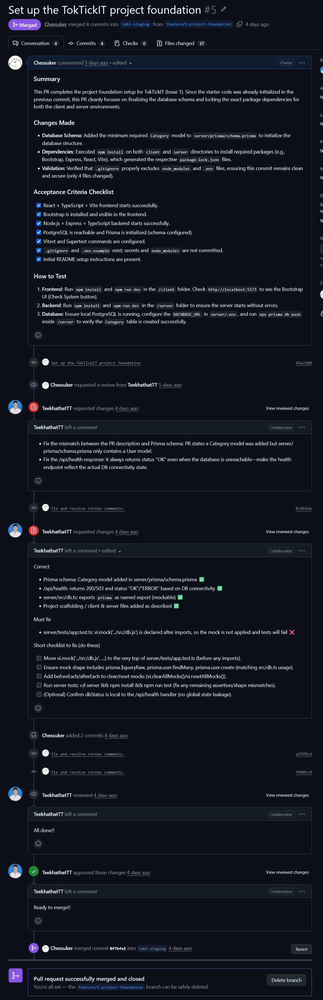
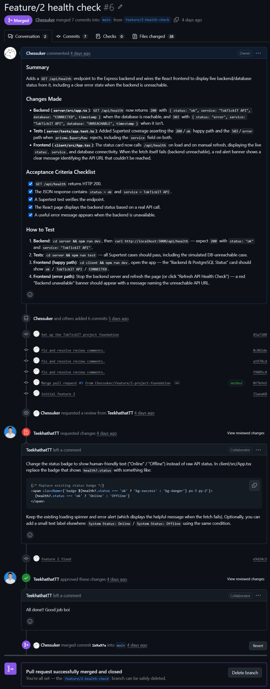
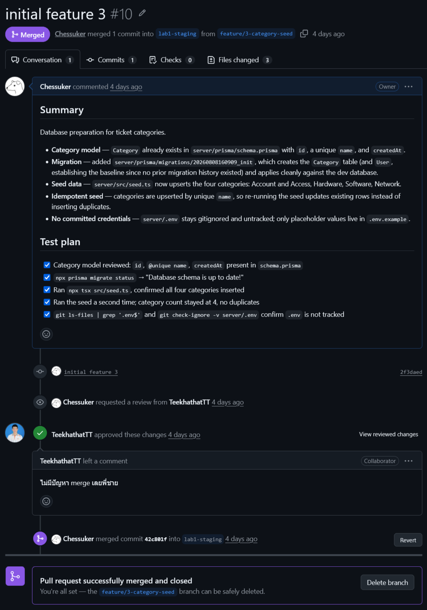
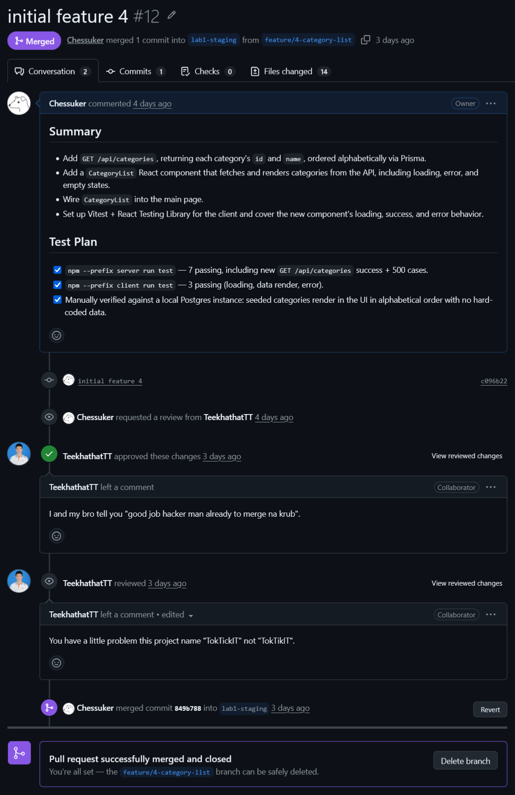
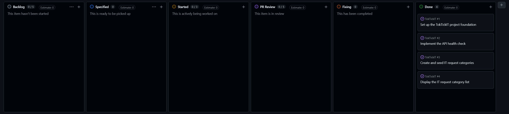

# Lab 1 — Peer Review Documentation

## 1. Peer Reviewer Information

| Field | Detail |
| --- | --- |
| Name | นายทีฆทัศน์ วงศ์สิบสันตติ |
| Student ID | 67070501019 |
| GitHub Username | TeekhathatTT |

## 2. Reviewed PR Links

PRs submitted by me and reviewed by my partner, as well as PRs submitted by my partner and reviewed by me.

| # | PR Link | Submitted By | Reviewed By |
| --- | --- | --- | --- |
| 1 | https://github.com/Chessuker/TokTickIT/pull/5 | [To be filled] | [To be filled] |
| 2 | https://github.com/Chessuker/TokTickIT/pull/6 | [To be filled] | [To be filled] |
| 3 | https://github.com/Chessuker/TokTickIT/pull/10 | [To be filled] | [To be filled] |
| 4 | https://github.com/Chessuker/TokTickIT/pull/12 | [To be filled] | [To be filled] |

## 3. My PR Reviews (Submitted by me, reviewed by partner)

| PR Link | Partner's Review Comments | My Response |
| --- | --- | --- |
| https://github.com/Chessuker/TokTickIT/pull/5 | Fix the mismatch between the PR description and Prisma schema: PR states a Category model was added but server/prisma/schema.prisma only contains a User model.<br>Fix the /api/health response: it always returns status "OK" even when the database is unreachable—make the health endpoint reflect the actual DB connectivity state. | fix and resolve review comments. |
| https://github.com/Chessuker/TokTickIT/pull/5 | Correct<br>    Prisma schema: Category model added in server/prisma/schema.prisma ✅<br>    /api/health: returns 200/503 and status "OK"/"ERROR" based on DB connectivity ✅<br>    server/src/db.ts: exports prisma as named export (mockable) ✅<br>    Project scaffolding / client & server files added as described ✅<br><br>Must fix<br><br>    server/tests/app.test.ts: vi.mock('../src/db.js') is declared after imports, so the mock is not applied and tests will fail ❌<br><br>Short checklist to fix (do these)<br><br>    Move vi.mock('../src/db.js', ...) to the very top of server/tests/app.test.ts (before any imports).<br>    Ensure mock shape includes prisma.$queryRaw, prisma.user.findMany, prisma.user.create (matching src/db.ts usage).<br>    Add beforeEach/afterEach to clear/reset mocks (vi.clearAllMocks()/vi.resetAllMocks()).<br>    Run server tests: cd server && npm install && npm run test (fix any remaining assertion/shape mismatches).<br>    (Optional) Confirm dbStatus is local to the /api/health handler (no global state leakage). | fix and resolve review comments. |
| https://github.com/Chessuker/TokTickIT/pull/6 | Change the status badge to show human-friendly text ("Online" / "Offline") instead of raw API status. In client/src/App.tsx replace the badge that shows `health?.status` with something like:<br><br>```tsx<br>{/* Replace existing status badge */}<br><span className={`badge ${health?.status === 'ok' ? 'bg-success' : 'bg-danger'} px-3 py-2`}><br>  {health?.status === 'ok' ? 'Online' : 'Offline'}<br></span><br>```<br><br>Keep the existing loading spinner and error alert (which displays the helpful message when the fetch fails). Optionally, you can add a small text label elsewhere: `System Status: Online` / `System Status: Offline` using the same condition. | feature 2 fixed |
| https://github.com/Chessuker/TokTickIT/pull/10 | ไม่มีปัญหา merge เลยพี่ชาย | - |
| https://github.com/Chessuker/TokTickIT/pull/12 | I and my bro tell you "good job hacker man already to merge na krub". | - |

## 4. Partner's PR Reviews (Submitted by partner, reviewed by me)

| PR Link | My Review Comments | Partner's Response |
| --- | --- | --- |
| https://github.com/TeekhathatTT/CPE334-TokTickIT/pull/5 | **A few blocking changes are needed before this can be merged:**<br><br>**Please make the following changes**<br><br>**1. Remove compiled/transpiled artifacts from `client/src`**<br>Remove compiled/transpiled artifacts from `client/src` (e.g. `App.js`, `main.js` that import from `react/jsx-runtime`). Commit the original source files (`App.jsx` / `App.tsx`, `main.jsx` / `main.tsx`) instead and add build/dist output to `.gitignore`. If those files were accidentally committed, remove them and commit the removal.<br><br>**2. Make the PR match its description or update the description**<br>- If this PR is intended to include backend + Prisma + `.env.example` + README, add the server source (Express app, server `package.json`, `tsconfig`, Prisma schema/migrations, and `.env.example`) and README setup instructions.<br>- If this is frontend-only, update the title/body to reflect that and remove backend items from the acceptance criteria.<br><br>**3. Implement the frontend API or adjust tests**<br>Implement `client/src/api.js` (`checkSystem`) or ensure tests mock it. Right now `api.js` throws and tests expect behavior that isn’t implemented.<br><br>**4. Ensure package metadata and scripts exist**<br>Add `client/package.json` and `server/package.json` (as applicable) with dev/start/test scripts (Vite, Vitest, node/ts-node or equivalent). Confirm which package manager (`npm`/`pnpm`/`yarn`) you intend to use and be consistent.<br><br>**5. Add `.env.example` and README instructions**<br>Add `.env.example` (including `VITE_API_URL` and any server env vars) and a short README section with local setup and test instructions.<br><br>**6. Run tests locally and ensure CI passes**<br>Run tests locally and ensure CI (if present) runs Vitest and passes before requesting another review.<br><br>**Quick checklist:**<br>- [x] Remove compiled/transpiled files from `client/src`<br>- [x] Commit original source files (jsx/tsx)<br>- [x] Add build/dist to `.gitignore`<br>- [x] Add server source + Prisma (if backend is intended here) or update PR description to frontend-only<br>- [x] Implement `client/src/api.js` or mock it in tests<br>- [x] Add `package.json`(s) with start/dev/test scripts<br>- [x] Add `.env.example` and README setup steps<br>- [x] Confirm tests pass locally / in CI | chore: sync changes for lab1 (client cleanup, server routes, prisma, README, env.example) |
| https://github.com/TeekhathatTT/CPE334-TokTickIT/pull/6 | **There are a few repo-cleanup blockers before we can merge:**<br><br>### Blocking Issues to Fix<br><br>**1. Remove Compiled JS Artifacts:** Please delete `client/src/App.js` and `client/src/main.js` from the repository. Only original source files (`App.tsx`, `main.tsx`) should be committed.<br><br>**2. Delete Duplicate File:** Please remove `client/src/api.js` and keep only `client/src/api.ts`.<br><br>**3. Fix Import Path:** In `client/src/App.tsx`, change `import ... from "./api.js"` to `import ... from "./api"` so TypeScript resolves types properly. | chore(client): remove compiled JS artifacts and fix api import and fix(client): implement health and categories checks  |
| https://github.com/TeekhathatTT/CPE334-TokTickIT/pull/6 | **There is a major blocker preventing this PR from being merged:**<br><br>### Critical Blocker (Runtime Failure)<br><br>- **Mismatch between Frontend and Backend:** In `client/src/api.ts`, `checkSystem()` is trying to fetch `${API_URL}/api/categories`. However, the backend (`server/src/app.ts`) in this PR only implements `/api/health`. When clicking the button, it throws an error and fails.<br>- **Fix needed:** Since Issue 2 is only scoped for the Health Check, please update `checkSystem()` in `client/src/api.ts` to only call `/api/health` and return `{ online: true, categories: [] }` for now. (The `/api/categories` endpoint belongs to Issue 4!).<br><br>### Code Cleanup & Minor Fixes<br><br>**1. `client/src/App.tsx`:**<br>- Remove the leftover line `void categories;`.<br>- Add `type="button"` to the `[Check System]` button element.<br><br>**2. `client/tests/lab-01/App.test.js`:**<br>- Replace the TODO test stubs with actual passing tests (mocking `checkSystem` for Online/Offline states).<br><br>**Please fix these issues on this branch and push again so I can re-check and Approve!** | fix: resolve health check merge conflict and fix(client): align Issue 2 behavior and tests |
| https://github.com/TeekhathatTT/CPE334-TokTickIT/pull/7 | **A few small requests before I approve:**<br><br>**Seed reliability:** please ensure the Prisma client is always disconnected and errors are surfaced.<br>- Wrap the seeding logic in `try/catch/finally` and call `await prisma.$disconnect()` in `finally`.<br>- Replace the bare `main()` call with `main().catch(e => { console.error(e); process.exit(1); });` so CI exits non-zero on failures.<br>- Add more context to error logs (e.g., include the category name that failed) to make CI debugging easier.<br><br>**Migration timestamp type:** confirm timezone semantics for `createdAt`.<br>- The migration currently uses `TIMESTAMP(3) NOT NULL DEFAULT CURRENT_TIMESTAMP`. If the app expects timezone-aware timestamps, change this to `TIMESTAMPTZ` or explicitly confirm that DB-local timestamps are intended.<br>- Also confirm that Prisma's `@default(now())` matches the DB default precision/behavior you want.<br><br>**Unique index semantics:** confirm case-sensitivity expectations for `name`.<br>- The unique index enforces case-sensitive uniqueness by default. If case-insensitive uniqueness is needed, consider using `CITEXT` or a functional index and document that choice.<br><br>**Docs:** add a short note to the README (or contributing docs) with the commands to run the migration and seed locally, including required environment variables. This helps contributors reproduce the setup.<br><br>**Optional (not blocking):**<br>- You may choose to upsert categories concurrently with `Promise.all(...)` for speed; if sequential awaits are kept, consider adding a short comment explaining the choice. | chore(prisma): improve seed reliability and docs |
| https://github.com/TeekhathatTT/CPE334-TokTickIT/pull/8 | Approve | - |

## 5. Screenshot Evidence

### 5.1 PR Approval Evidence









### 5.2 Kanban Board Evidence


