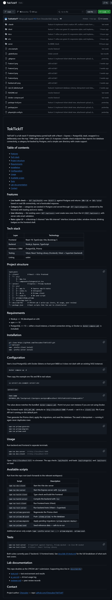

# Answer Part 1 — Git Use with Engineering Workflow

Repository: <https://github.com/Chessuker/TokTickIT> · Final branch: `main` at `9936b8c`

---

## 1. Branch and merge history on `main`

Every issue was built on its own feature branch, merged into `lab2-staging` through a pull request, and reached `main` only through a second pull request from staging. No commit was pushed straight to `main`.


The graph above is the verbatim output of `git log --graph --oneline --decorate -25`, kept as text in [`test-runs/git-history.txt`](test-runs/git-history.txt). Read from the bottom up it shows seven feature branches converging on `lab2-staging`, and `lab2-staging` converging on `main` in a single merge at the top.

| Issue | Feature branch | PR | Merged into | Date |
| --- | --- | --- | --- | --- |
| #1 Spec & test planning | `feature/1-spec-docs` | [#26](https://github.com/Chessuker/TokTickIT/pull/26) | `lab2-staging` | 2026-08-23 |
| #2 Database schema & seed | `feature/2-db-schema-seed` | [#27](https://github.com/Chessuker/TokTickIT/pull/27) | `lab2-staging` | 2026-08-27 |
| #3 Requester context | `feature/3-requester-context` | [#28](https://github.com/Chessuker/TokTickIT/pull/28) | `lab2-staging` | 2026-08-28 |
| #4 Ticket creation | `feature/4-create-ticket` | [#29](https://github.com/Chessuker/TokTickIT/pull/29) | `lab2-staging` | 2026-08-29 |
| #5 My Tickets list | `feature/5-my-tickets-list` | [#30](https://github.com/Chessuker/TokTickIT/pull/30) | `lab2-staging` | 2026-08-30 |
| #6 Ticket detail & attachments | `feature/6-ticket-detail-attachments` | [#31](https://github.com/Chessuker/TokTickIT/pull/31) | `lab2-staging` | 2026-09-04 |
| #7 UI refinement & E2E | `feature/7-ui-responsive-e2e` | [#32](https://github.com/Chessuker/TokTickIT/pull/32) | `lab2-staging` | 2026-09-05 |
| — sprint release | `lab2-staging` | [#33](https://github.com/Chessuker/TokTickIT/pull/33) | **`main`** | 2026-09-05 |

The same shape is visible on GitHub: the repository home page below shows `main` with **16 branches**, its latest commit being the release merge [#33](https://github.com/Chessuker/TokTickIT/pull/33) from `lab2-staging`.

---

## 2. GitHub Project and final Kanban


Project **TokTickIT Individual Sprints Lab 2**. All seven sprint issues sit in **Done** and every
other column — Backlog, Specified, Started, PR Review, Fixing — is empty:

| Card | Sprint issue |
| --- | --- |
| TokTickIT #19 | Issue #1: Sprint Specifications, Architecture & Test Planning |
| TokTickIT #20 | Issue #2: Database Schema & Idempotent Seed Data |
| TokTickIT #21 | Issue #3: Development Requester Context & Simulated Login |
| TokTickIT #22 | Issue #4: Ticket Creation API & UI with Validation |
| TokTickIT #23 | Issue #5: My Tickets List with Filtering, Search & Pagination |
| TokTickIT #24 | Issue #6: Requester Ticket Detail & Soft Attachment Lifecycle |
| TokTickIT #25 | Issue #7: UI Refinement, Responsive Layout & End-to-End Tests |

The card numbers are GitHub issue numbers; the sprint numbering used throughout this documentation
is the "Issue #1 … #7" in each title.

---

## 3. Peer review

The reviewer's identity, the comments given and received, the responses and the approvals are recorded in [reviewer.md](reviewer.md), which is submitted rendered alongside this part.

Two of the seven pull requests were sent back before they were approved. PR #31 is the clearest
record of the whole cycle on one page — review, fix, approval, merge:


Reading down the conversation: TeekhathatTT **requested changes** on the 413/415 defect, the fix
landed in commit `4db72b0`, and TeekhathatTT then **approved these changes** and merged. PR #32 shows
a clean approval on the final issue:


Approvals on PR [#26](screenshots/pr-approval-%2326.png) and PR
[#29](screenshots/pr-approval-%2329.png) are captured too, and are reproduced under Answer Part 2
where their merge dates are the point.

---

## 4. README

The repository README is at [`README.md`](../../README.md) — 153 lines covering what the project is, the stack, the directory layout, how to run the database, server and client, and the test commands.



The same capture doubles as evidence for the repository layout below: the file listing above the
README shows the tracked root — `.claude/`, `client/`, `docs/`, `e2e/`, `server/`, `docker-compose.yml`,
`playwright.config.ts`, `package.json` — with each entry's last commit message beside it.

---

## 5. `.gitignore`

```gitignore
# Dependencies
node_modules/

# Environment & Secrets
.env
.env.local
.env.*.local

# Build output
dist/
build/
*.tsbuildinfo

# Logs
npm-debug.log*
yarn-debug.log*
yarn-error.log*
logs/
*.log

# IDE & OS files
.vscode/
.idea/
.DS_Store
Thumbs.db

# Course material, not project source
Lab_02_labsheet.pdf

# Uploaded attachments (local disk storage, API-D-01)
server/uploads/

# Playwright
e2e/report/
test-results/
playwright/.cache/
```

Three entries are worth pointing at, because they are decisions rather than boilerplate:

- **`.env`** — the database URL and port live there and are never committed. `server/.env` is required to run the stack; the README says what it must contain.
- **`server/uploads/`** — attachments are stored on local disk (decision API-D-01 in [api-spec.md](api-spec.md)). The files uploaded during development and testing are real user data as far as the repository is concerned, so they stay out of it.
- **`test-results/`, `e2e/report/`** — Playwright's traces, videos and HTML report are regenerated on every run. The one piece of test output that *is* committed is `docs/lab-02/test-runs/*.txt`, because that is the Part 3 evidence.

---

## 6. Repository directory structure

Tracked files only, screenshots omitted for length. The full listing is in [`test-runs/directory-structure.txt`](test-runs/directory-structure.txt).

```text
TokTickIT/
├── client/                     React 19 + Vite frontend
│   ├── public/
│   └── src/
│       ├── assets/
│       ├── components/         AppShell, RequesterSelector, CreateTicketForm,
│       │                       MyTickets, TicketDetail, RequireRequester
│       │                       (each with its .test.tsx beside it)
│       ├── context/            RequesterProvider and the requester context
│       ├── pages/              Route wrappers: CreateTicket, MyTickets,
│       │                       TicketDetail, SystemStatus
│       ├── styles/             zen-green.css — the whole theme in one file
│       └── test/               Vitest setup
├── server/                     Express + Prisma backend
│   ├── prisma/
│   │   ├── migrations/         Two migrations: init, lab02_requester_ticketing
│   │   └── schema.prisma
│   ├── src/                    app.ts, db.ts, httpErrors.ts, requesterContext.ts,
│   │                           ticketNumber.ts, ticketValidation.ts,
│   │                           ticketListQuery.ts, attachmentRules.ts,
│   │                           attachmentUpload.ts, seed.ts, seedData.ts
│   └── tests/                  app, requesters, tickets, attachments, seed,
│                               ticketNumber
├── e2e/                        Playwright: create-ticket, attachments,
│                               ownership, requester-context, helpers
├── docs/
│   ├── lab-01/
│   └── lab-02/                 specification, api-spec, ui-spec, tests,
│                               ai-use, reviewer, answer-part* and screenshots
├── docker-compose.yml          PostgreSQL 16 on host port 5433
├── playwright.config.ts
├── package.json                Workspace scripts: dev, build, test, prisma
└── README.md
```

Two things the layout is deliberate about. Component tests sit beside the component they test rather than in a separate tree, so a file and its test move together. Server source is split by concern rather than by layer — `attachmentRules.ts` holds the rules with no Express or Prisma in it, which is what lets them be read and tested on their own.

_Screenshot to add: the same tree in the IDE's file explorer, which is the form the lab sheet asks for._

---

## Evidence index for this part

| Item | File |
| --- | --- |
| Branch and merge history on `main` | [`git-history.png`](screenshots/git-history.png), text in [`test-runs/git-history.txt`](test-runs/git-history.txt) |
| Final Kanban, all seven issues Done | [`kanban-final.png`](screenshots/kanban-final.png) |
| PR #26 — changes requested, then approved | [`pr-approval-#26.png`](screenshots/pr-approval-%2326.png) |
| PR #29 — approved | [`pr-approval-#29.png`](screenshots/pr-approval-%2329.png) |
| PR #31 — changes requested, fixed, approved | [`pr-approval-#31.png`](screenshots/pr-approval-%2331.png) |
| PR #32 — approved | [`pr-approval-#32.png`](screenshots/pr-approval-%2332.png) |
| Repository home page, file listing and rendered README | [`README-screenshot.png`](screenshots/README-screenshot.png) |
| Full tracked-file listing | [`test-runs/directory-structure.txt`](test-runs/directory-structure.txt) |
| Peer review record | [reviewer.md](reviewer.md) |
