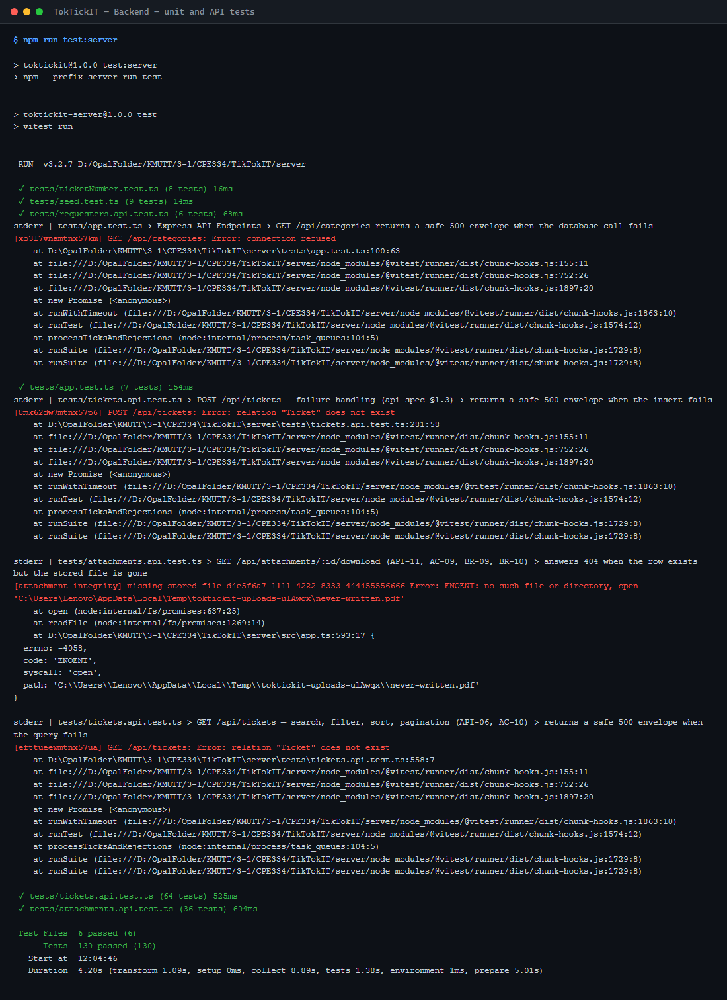
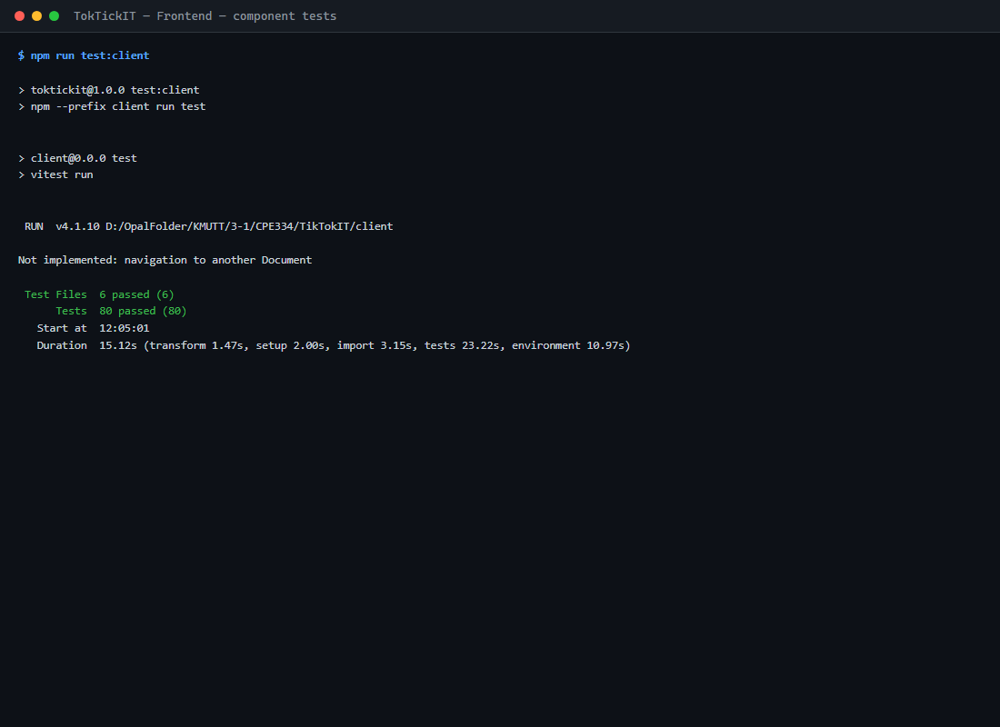
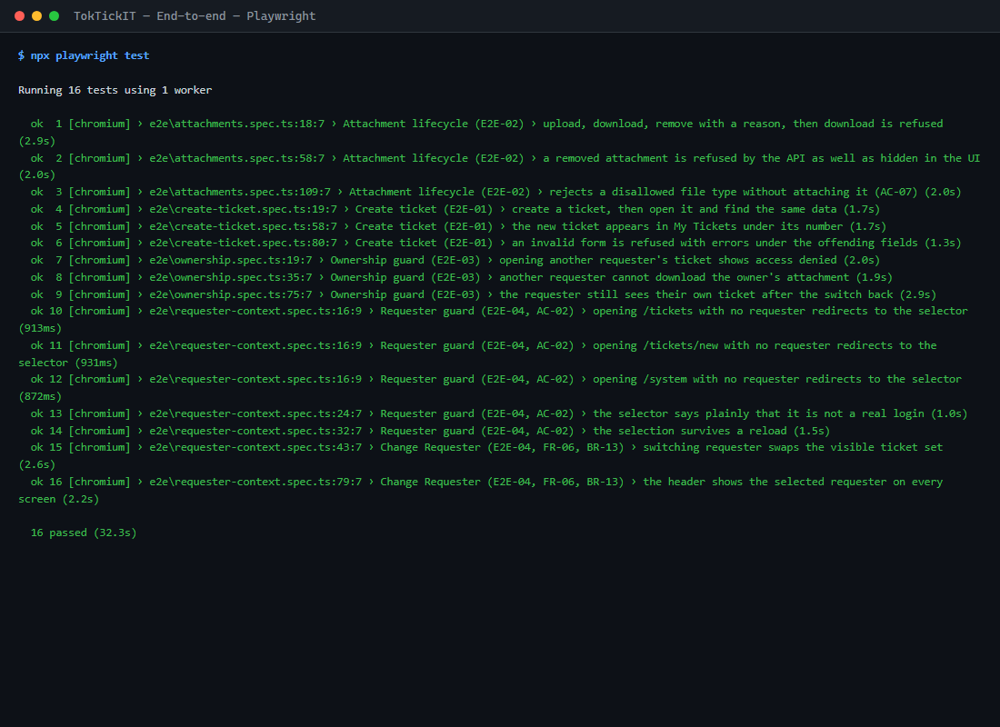

# Answer Part 3 — Automated Test Run Evidence

All three suites, run on 2026-09-05 with the stack up. 226 tests, 226 passing, nothing skipped.

| Suite | Command | Files | Tests | Passed | Failed |
| --- | --- | --- | --- | --- | --- |
| Backend — unit and API | `npm run test:server` | 6 | 130 | 130 | 0 |
| Frontend — component | `npm run test:client` | 6 | 80 | 80 | 0 |
| End-to-end — Playwright | `npx playwright test` | 4 | 16 | 16 | 0 |
| **Total** | | **16** | **226** | **226** | **0** |

The verbatim output of each command is kept in [`test-runs/`](test-runs/) — `server.txt`, `client.txt` and `e2e.txt` are the redirected stdout of the three runs, with colour codes stripped and nothing else changed. The images below are those same files rendered by [`screenshots/capture-test-runs.mjs`](screenshots/capture-test-runs.mjs); the text in each image is the log file, character for character.

---

## 1. Backend — unit and API tests



Six files: ticket creation and listing, the attachment lifecycle, the requester directory, the seed, and the ticket-number generator. The suite needs no database — `src/db.js` is mocked — but `attachments.api.test.ts` deliberately does not mock the file system, writing and reading real bytes in a temporary directory.

---

## 2. Frontend — component tests



Six files covering the selector and its guard, the create form and its validation, the list with its search, filter and two zero-result states, the read-only detail screen with its removal modal, and the app shell's Change Requester behaviour.

---

## 3. End-to-end — Playwright



Four specs, one per planned journey:

| Spec | Test ID | Journey |
| --- | --- | --- |
| `create-ticket.spec.ts` | E2E-01 | Select requester → fill form → submit → read the ticket number → open the detail screen and find the same data |
| `attachments.spec.ts` | E2E-02 | Upload → download → remove with a reason → the file is no longer downloadable, by the UI or by direct request |
| `ownership.spec.ts` | E2E-03 | Requester B opens Requester A's ticket URL and gets access denied, at the screen and at both endpoints |
| `requester-context.spec.ts` | E2E-04 | The guard redirects every route when no requester is selected; switching requester swaps the visible ticket set |

These run against the real stack, so they need it up first:

```bash
docker compose up -d && npm run prisma:migrate && npm run prisma:seed && npm run test:e2e
```

`playwright.config.ts` starts the API and Vite itself, reusing them if they are already running, but never the database — an E2E run that quietly created its own empty schema would pass against nothing.

---

## Reproducing this evidence

```bash
npm run test:server > docs/lab-02/test-runs/server.txt 2>&1
```

```bash
npm run test:client > docs/lab-02/test-runs/client.txt 2>&1
```

```bash
npx playwright test > docs/lab-02/test-runs/e2e.txt 2>&1
```

```bash
node docs/lab-02/screenshots/capture-test-runs.mjs
```
