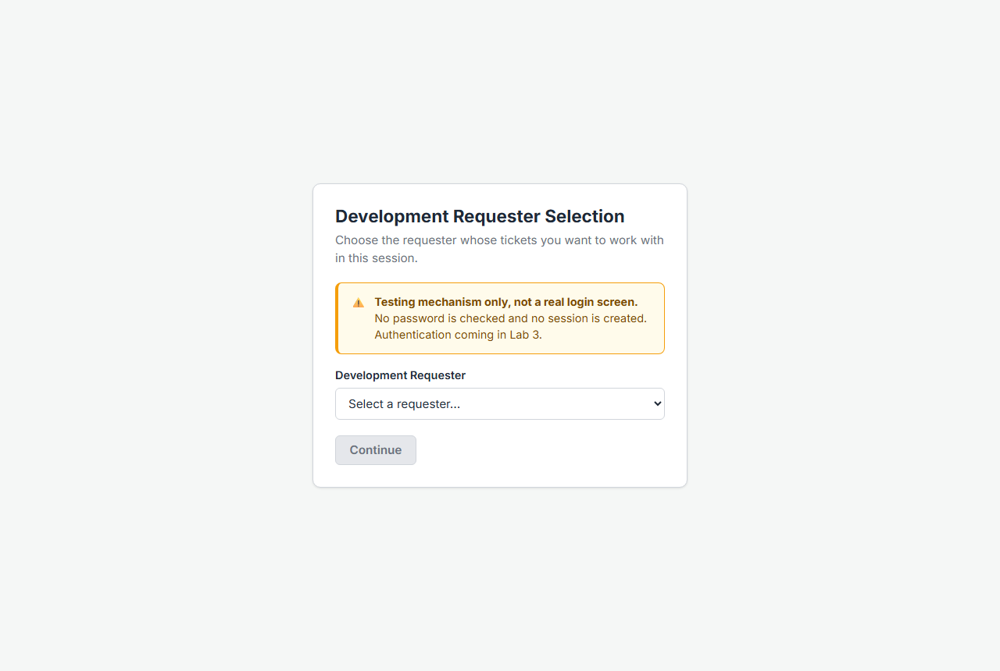
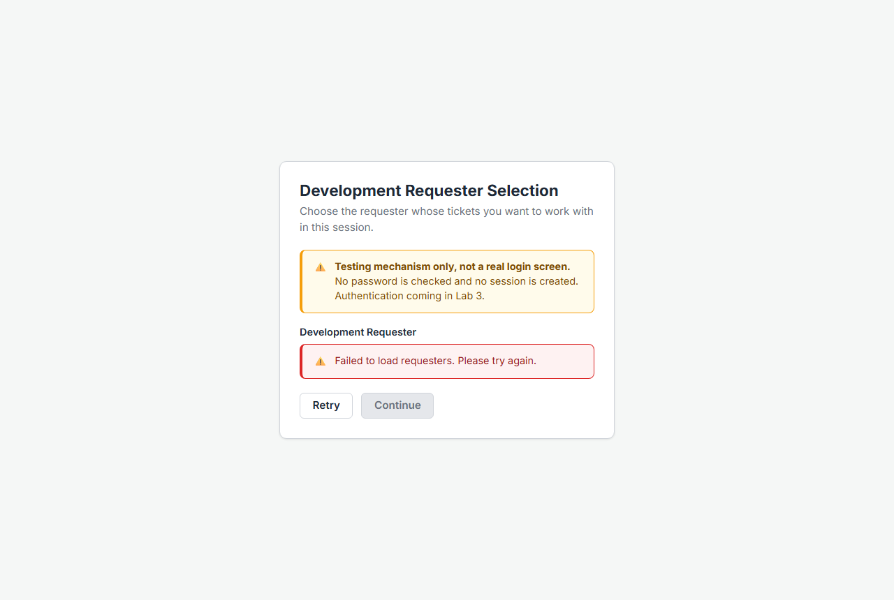
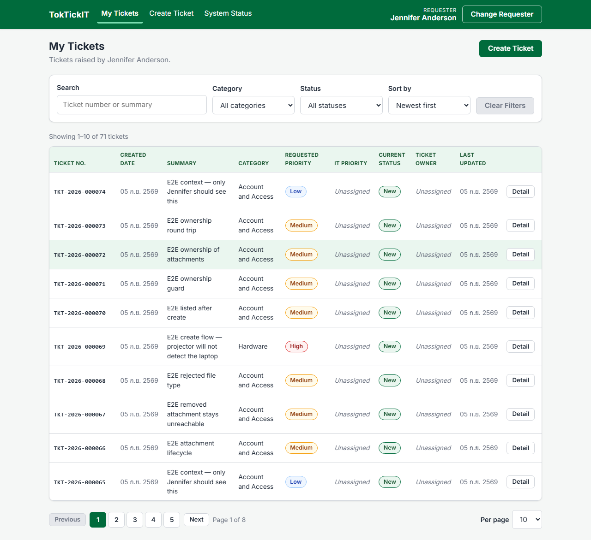

# Answer Part 5 — Development Requester Selection Screen

The simulated login used to choose whose tickets a session works with (FR-02, BR-03, BR-11, AC-02, AC-14). Its points are graded inside Part 6; this page is the evidence for the screen itself.

Captured against the running stack by [`screenshots/capture-part5.mjs`](screenshots/capture-part5.mjs) at 1280 px on 2026-09-05. The loading and failure states are produced by intercepting `GET /api/requesters` — delaying it, then failing it — rather than by editing the component, so what is shown is the real screen reacting to a real slow or broken response.

---

## 1. The selector, with active requesters only

Three things this screen has to say, and does:

- **It is not a login.** The amber callout states it outright: *"Testing mechanism only, not a real login screen. No password is checked and no session is created. Authentication coming in Lab 3."* (BR-03)
- **Only active requesters are listed.** The dropdown holds exactly four options — David Lee (Engineering), Jennifer Anderson (Registrar), Michael Brown (Library), Sarah Johnson (Finance). The seed also creates **Alex Smith (Facilities) with `isActive = false`**, and he is absent. `GET /api/requesters` filters on `isActive` in the query rather than comparing afterwards, so an inactive requester and a non-existent one answer identically (BR-11, AC-14).
- **Continue is disabled until something is chosen.** No default selection, so a session cannot start as "whoever happened to be first".

Covered by **API-12** in `server/tests/requesters.api.test.ts` and **UI-02** in `client/src/components/RequesterSelector.test.tsx`.

---

## 2. Loading state

While the request is in flight the dropdown is replaced by a spinner and a status line rather than by an empty select. An empty dropdown would read as "there are no requesters", which is a different fact from "the list has not arrived yet".

---

## 3. Failure state

When the request fails, the screen says so — *"Failed to load requesters. Please try again."* — in an error callout, and offers **Retry** beside a still-disabled **Continue**. The failure is recoverable in place: no reload, no navigation, and no way to continue past a list that was never loaded.

---

## 4. The selection in the application shell

After Continue, the header carries the selected requester's name and a **Change Requester** button, and both are present on every screen (FR-06). The list below is scoped to that requester by the server: the id travels in the `X-Requester-Id` header and `GET /api/tickets` writes it into the query's `where` clause, so no client-side filtering is involved (BR-04).

Switching requester unmounts and remounts the routed subtree keyed by requester id, so the previous requester's rows are gone rather than stale (BR-13). That switch is shown in [Answer Part 7](answer-part7-screenshots.md) and asserted by **UI-07** and end-to-end by **E2E-04**.

---

## What backs this screen in code and tests

| Concern | Where |
| --- | --- |
| Active-only directory | `server/src/app.ts` — `GET /api/requesters`, `where: { isActive: true }` |
| Guard when nothing is selected | `client/src/components/RequireRequester.tsx` — every route sits behind it |
| Selection persistence | `client/src/context/RequesterProvider.tsx` — session storage, so a reload does not bounce back to the selector but a new browser session starts clean |
| Tests | API-12, UI-01, UI-02, UI-07, E2E-04 |
