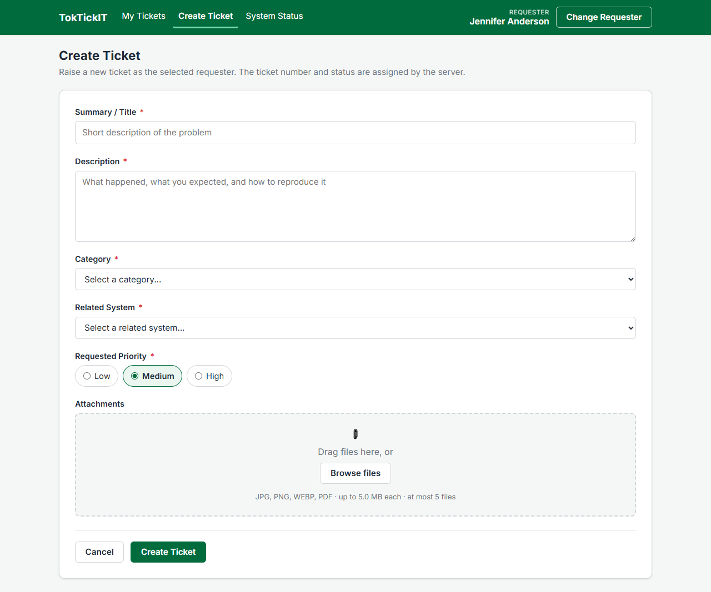
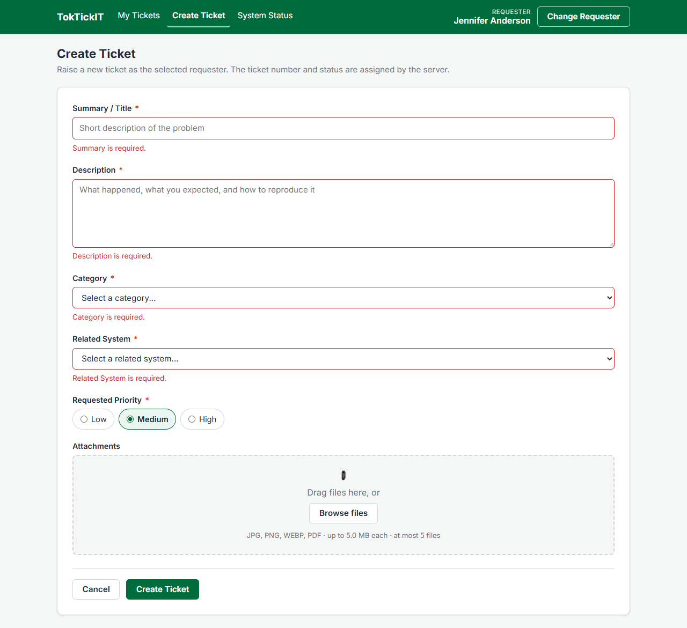
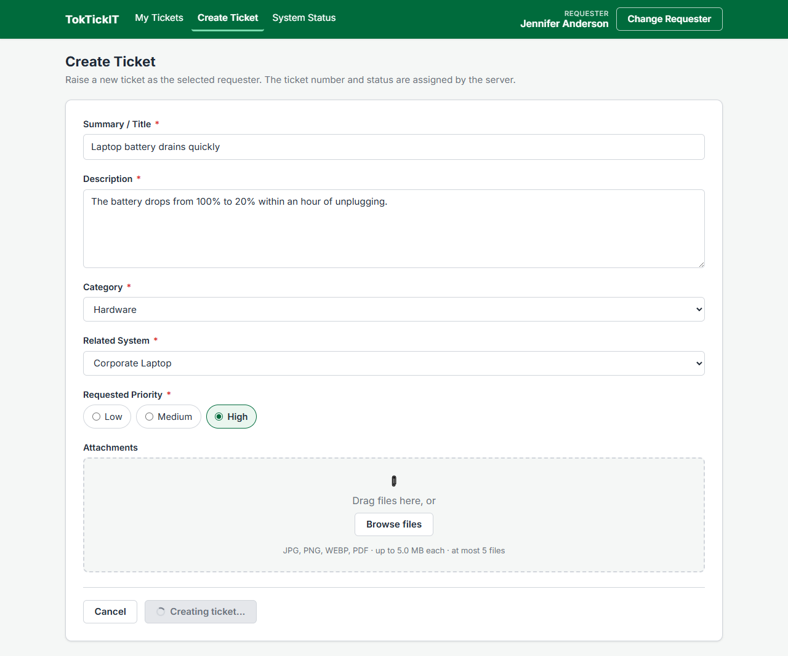
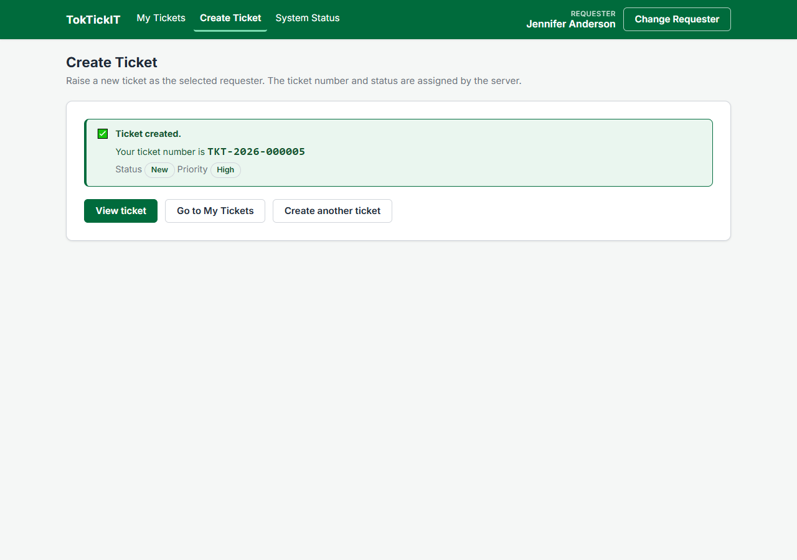
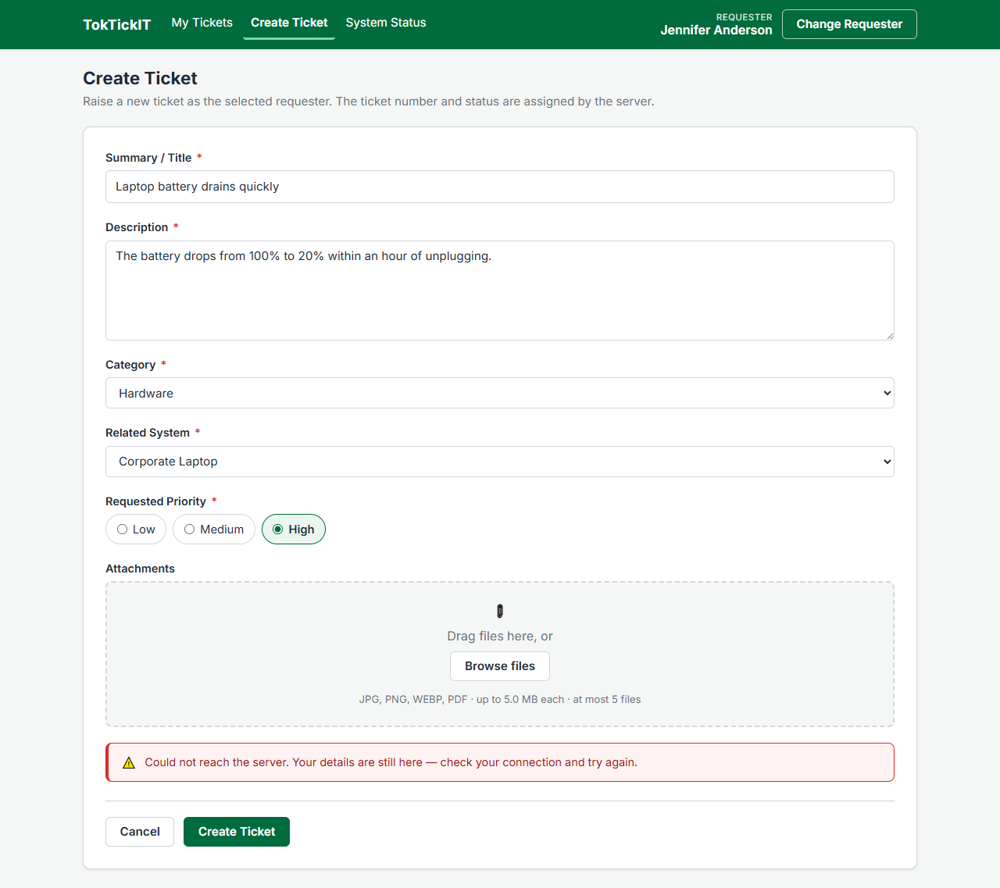
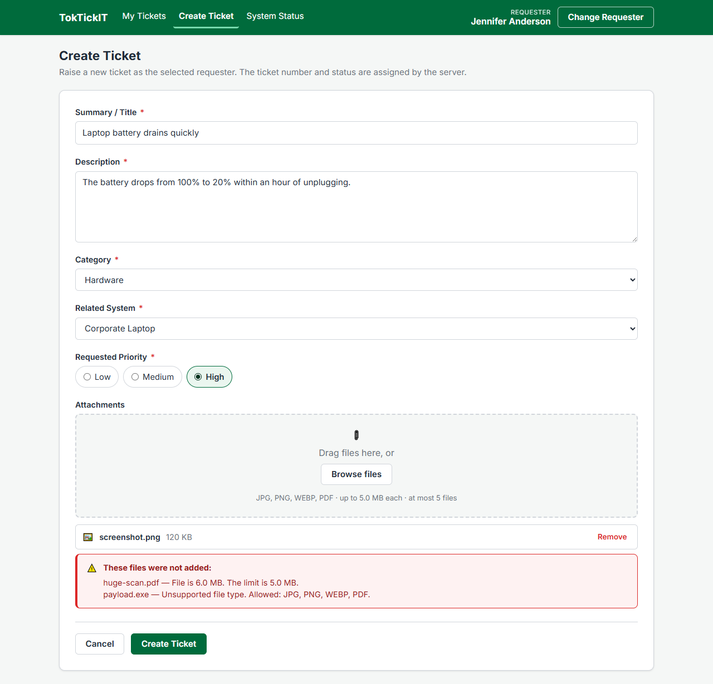

# Answer Part 6 — Create Ticket Screen Evidence (Issue #4)

Six screenshots recording the Create Ticket feature (FR-01, FR-07, AC-01, AC-12, BR-01, BR-02, BR-05 … BR-07).

Every image was captured against the **running stack with a real database** — Vite dev server, the Express API on port 5000, and seeded PostgreSQL 16 in Docker. The ticket numbers shown are rows that genuinely exist in the `Ticket` table; nothing here is a mock-up.

| Item | Value |
| --- | --- |
| Captured | 2026-08-28 |
| Requester in session | Jennifer Anderson — Registrar |
| Browser / viewport | Chrome, 1280 px wide, full-page capture |
| Database | PostgreSQL 16 (Docker), seeded with 4 categories and 7 related systems |

---

## 0. Before the form — the Development Requester

The lab sheet folds Part 5 into this part's points. The selector screen, its
active-only dropdown, its loading and failure states, and the selected requester
shown in the application shell with Change Requester are in
[Answer Part 5](answer-part5-requester-selector.md).

The link matters for §4 below: the Requester saved on the ticket is the one
chosen there, and it is never read from the form.

---

## 1. Create Ticket, empty, with master data loaded



The screen after `GET /api/categories` and `GET /api/related-systems` have both resolved. Both dropdowns are enabled and populated from the database, each required field carries a red `*`, and the attachment dropzone states the allowed types, size limit and file cap.

Neither Ticket Number nor Status appears as an input — both are server-owned (BR-01, BR-02).

---

## 2. Validation errors under the fields



Submitting an empty form. Each message renders **directly under its own field** in `--zg-error`, and the field border turns error-colored (ui-spec §2, V-08). No request is sent while the form is invalid.

Covered by test **UI-03** in `client/src/components/CreateTicketForm.test.tsx`.

---

## 3. Submitting / busy state



While the `POST /api/tickets` request is in flight the button is disabled, shows a spinner, and its label swaps to *Creating ticket…* — so a second click cannot double-submit.

---

## 4. Success, with the Ticket Number from the database



The confirmation shows `TKT-2026-000005`, generated server-side in the same transaction as the insert, together with status `New` and the requested priority. Onward navigation to the ticket detail or to My Tickets is offered.

This satisfies **AC-01**. Verified directly in the database:

```
  ticketNumber   | status | priority
-----------------+--------+----------
 TKT-2026-000001 | New    | High
 TKT-2026-000002 | New    | Low
 TKT-2026-000003 | New    | High
 TKT-2026-000004 | New    | High
 TKT-2026-000005 | New    | High
```

The sequence increments and never repeats (BR-01), and every row lands with status `New` (BR-02).

---

## 5. Backend failure — form values preserved



The API is unreachable when Create Ticket is pressed. An error callout appears above the form actions, **every entered value stays in the form**, and the submit button returns to its idle state so the user can retry immediately.

Read back from the DOM at the moment of capture:

| Field | Value still present |
| --- | --- |
| Summary / Title | Laptop battery drains quickly |
| Description | The battery drops from 100% to 20% within an hour of unplugging. |
| Category | Hardware |
| Related System | Corporate Laptop |
| Requested Priority | High |

This satisfies **AC-12 / FR-07**, and is covered by test **UI-08**.

> The capture reproduces the failure by refusing the connection at the browser. The same behaviour was also confirmed by genuinely stopping the Express server mid-session: the callout appeared, the values survived, and pressing Create Ticket again after restarting the server produced the next number in sequence.

---

## 6. Attachment selection — valid and invalid



Three files were offered at once:

| File | Size | Type | Outcome |
| --- | --- | --- | --- |
| `screenshot.png` | 120 KB | `image/png` | **Accepted** — listed with size and a Remove control |
| `huge-scan.pdf` | 6.0 MB | `application/pdf` | Rejected — over the 5 MB limit (BR-06) |
| `payload.exe` | 2 KB | `application/x-msdownload` | Rejected — unsupported type (BR-05) |

Each rejection names the file and the rule it broke. The sixth file in a selection is also refused (BR-07).

**Scope note:** uploading is not part of Issue #4 — `POST /api/tickets/:id/attachments` belongs to Issue #6. Files here are validated and staged in the browser only, and the success screen says plainly that staged files were not attached rather than dropping them silently.

---

## Reproducing these screenshots

With Docker running and the database seeded, start both dev servers, then:

```bash
node docs/lab-02/screenshots/capture.mjs
```

The script drives a real Chrome through all six states and overwrites the PNGs in place. Each run creates real tickets, so the number in screenshot 4 advances.
