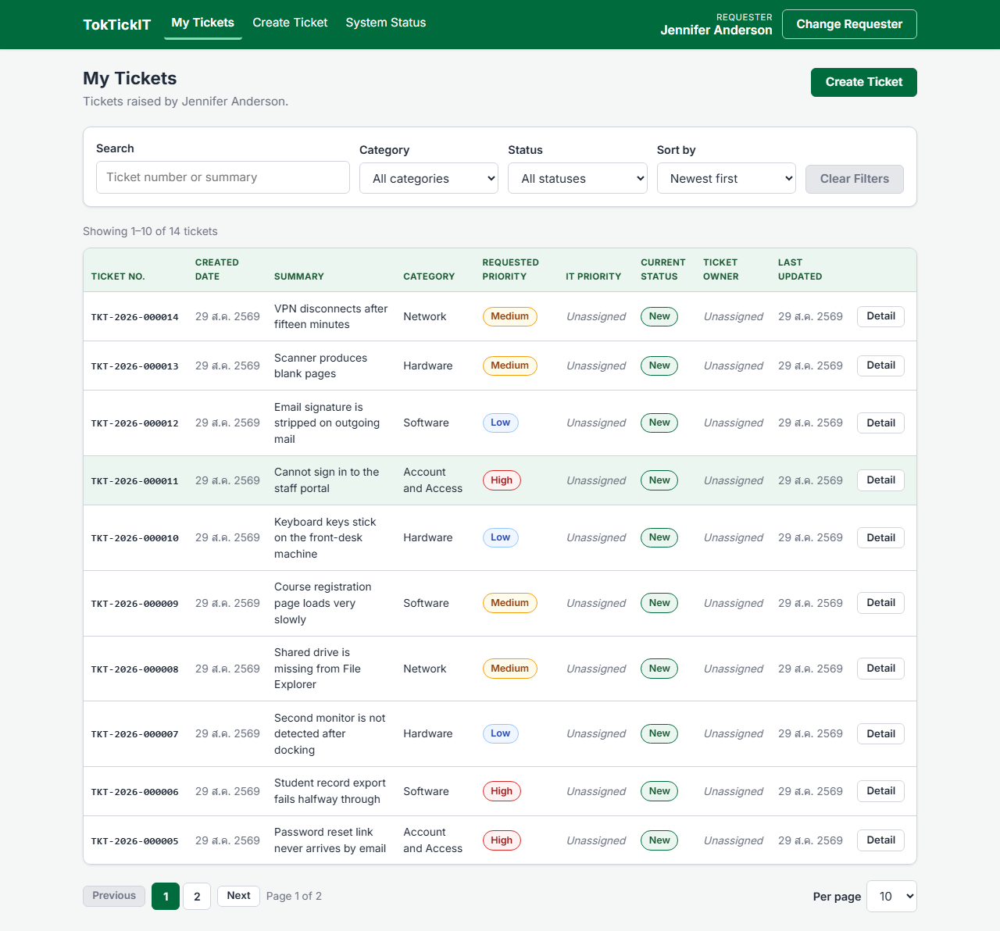
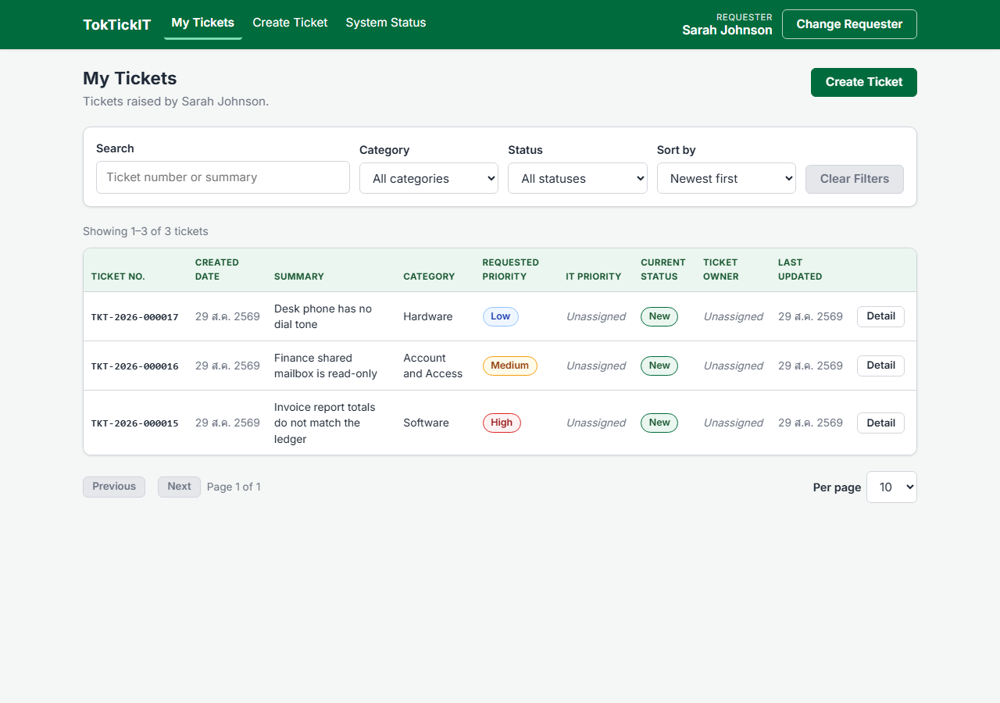
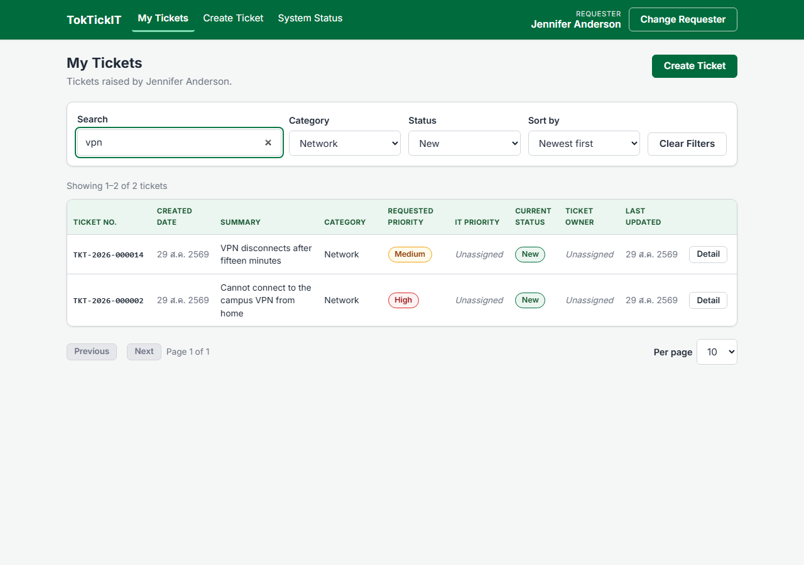
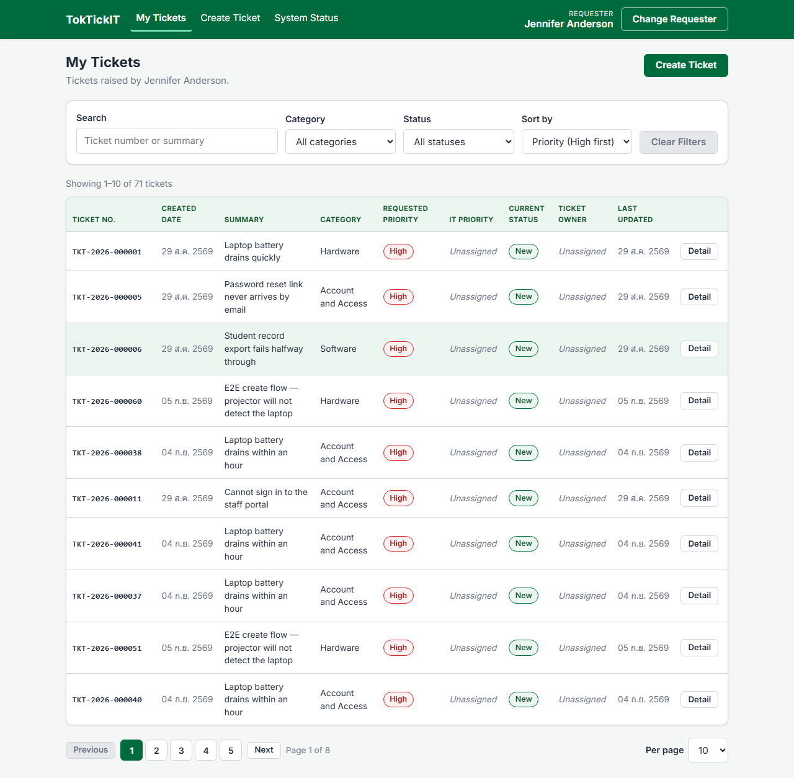
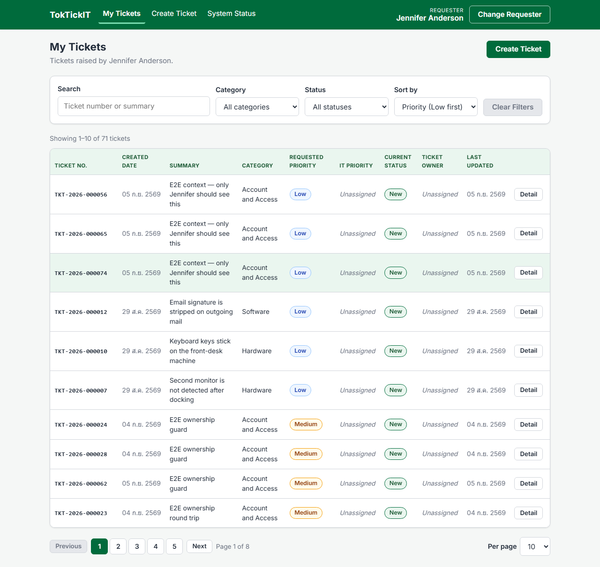
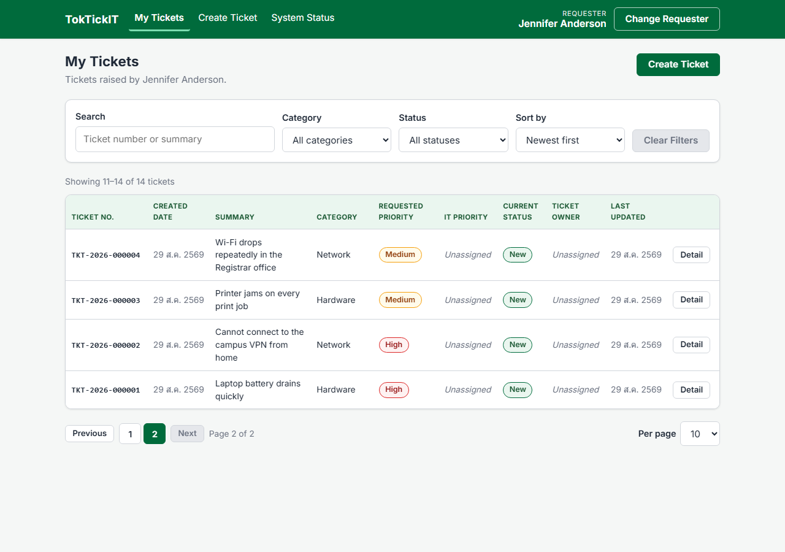
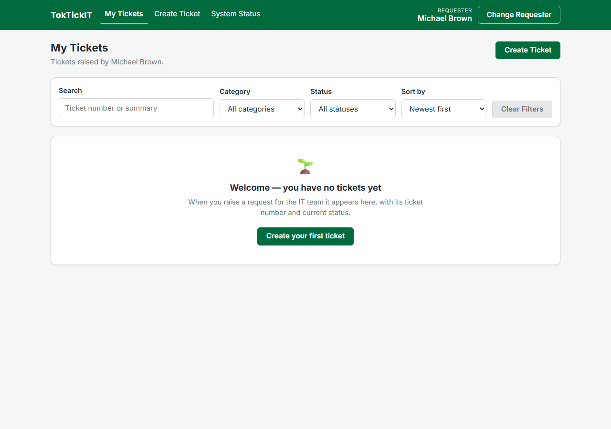
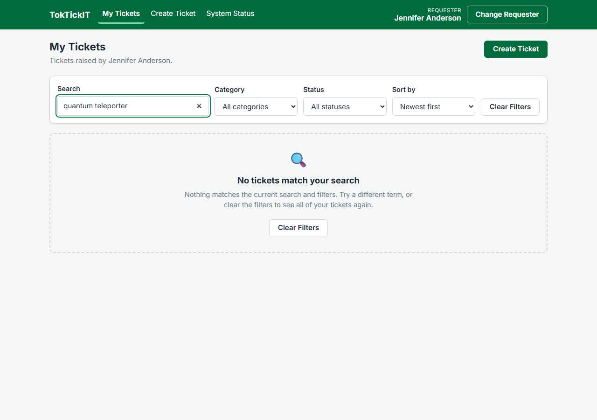
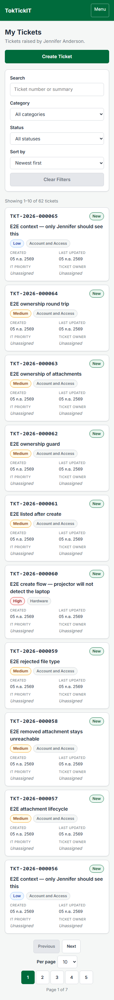

# Answer Part 7 — My Tickets List Evidence (Issue #5)

Six screenshots recording the My Tickets feature (FR-03, AC-04, AC-10, AC-15, BR-04, BR-13).

Every image was captured against the **running stack with a real database** — Vite dev server, the Express API on port 5000, and seeded PostgreSQL 16 in Docker. The ticket numbers shown are rows that genuinely exist in the `Ticket` table; nothing here is a mock-up.

| Item | Value |
| --- | --- |
| Captured | 2026-08-29 |
| Requester A | Jennifer Anderson — Registrar (14 tickets) |
| Requester B | Sarah Johnson — Finance (3 tickets) |
| Requester with no tickets | Michael Brown — Library |
| Browser / viewport | Chromium, 1280 px wide (375 px for the mobile check), full-page capture |
| Database | PostgreSQL 16 (Docker), seeded with 4 categories and 7 related systems |
| Capture script | [`screenshots/capture-issue5.mjs`](screenshots/capture-issue5.mjs) |

The tickets were created through the real `POST /api/tickets`, so every row carries a server-generated ticket number and a server-owned `New` status.

---

## 1. Requester A with their tickets listed



Jennifer Anderson's 14 tickets, newest first, ten to a page. The table carries all ten columns the issue specifies: Ticket No., Created Date, Summary, Category, Requested Priority, IT Priority, Current Status, Ticket Owner, Last Updated, and a Detail action.

Status renders as a `New` pill and Requested Priority as a `Low` / `Medium` / `High` pill (ui-spec §2). IT Priority and Ticket Owner show an italic _Unassigned_ placeholder: both are IT-triage fields with no column in the Lab 2 schema, and an explicit placeholder keeps "not yet assigned" from reading as missing data.

Covered by test **UI-04** in `client/src/components/MyTickets.test.tsx` and **API-04** in `server/tests/tickets.api.test.ts`.

---

## 2. Switching to Requester B — Requester A's tickets are gone



The same screen immediately after switching to Sarah Johnson through the header's Change Requester control. Every one of Jennifer's rows is gone and only Sarah's three tickets (TKT-2026-000015 … 000017) remain — the count line reads *Showing 1–3 of 3 tickets*.

This is BR-04 and BR-13 together. Ownership is enforced server-side: `requesterId` is written into the query's `where` from the resolved `X-Requester-Id` header, and no query parameter can widen it — a `requesterId` supplied in the query string is ignored outright. On the client, AppShell keys the routed subtree by the requester id, so the switch unmounts the list and remounts it empty rather than leaving stale rows on screen.

Covered by **API-04** (ownership scoping assertions) and **UI-07**.

---

## 3. Search and the Category / Status filters in use



Search `vpn`, Category `Network`, Status `New` applied together. Two of the fourteen tickets match, and the result count updates with them.

The search is case-insensitive — `vpn` matches both *VPN disconnects after fifteen minutes* and *Cannot connect to the campus VPN from home* — and runs against `ticketNumber`, `summary` and `description` on the server, not against the loaded page. Each control maps to one query parameter (`search`, `category`, `status`), and the input is debounced 300 ms so typing does not fire a request per keystroke.

Covered by **API-06** and **UI-04**.

---

## 3b. Sorting



`Priority (High first)` selected. Every row on page 1 is **High**, where the
default `Newest first` order interleaved them — the same ten rows read
Low, Medium, Medium, Medium, Medium, High, Medium, Medium, Medium, Low before the
sort was changed.



Reversed to `Priority (Low first)`, page 1 becomes Low, Low, Low, Low, Low, Low,
Medium, Medium, Medium, Medium.

The ordering is the server's: the control writes the `sort` query parameter and
the endpoint orders in SQL, so it applies to the whole result set rather than to
the ten rows already on screen. Priority sorts by rank rather than alphabetically
— High, Medium, Low, not High, Low, Medium — and every sort is tie-broken by `id`
ascending so no row can appear on two pages.

These two captures were taken later than the rest of Part 7, after the
end-to-end suite had added tickets, so the dataset is larger than the fourteen
tickets in the images above.

Covered by **API-06** and **UI-04**.

---

## 4. Pagination controls



Page 2 of Jennifer's list. *Showing 11–14 of 14 tickets*, the page-2 button is marked current, Next is disabled because there is no page 3, and Previous is enabled.

The metadata comes from the server (`page`, `pageSize`, `totalItems`, `totalPages`, `hasNextPage`, `hasPreviousPage`); every sort is tie-broken by `id` ascending so no row can appear on two pages. Changing search, filter, sort or page size returns to page 1 — staying on page 3 of a narrower result set is how a working filter comes to look like it matched nothing.

Covered by **API-06** and **UI-04**.

---

## 5. Empty state — the requester has no tickets



Michael Brown has never raised a ticket. The screen shows a welcome message on a solid white card with a single primary call to action, *Create your first ticket*.

There is deliberately no "Clear Filters" button here: no filter is active, so there is nothing to clear.

Covered by **UI-09**.

---

## 6. No-results state — the search matched nothing



The same requester as screenshot 1, searching for `quantum teleporter`. The server answers `200` with an empty array and `totalItems: 0` — not a `404` and not an error.

AC-15 requires this to be visibly distinct from the empty state above, and it is, in three ways: a dashed tinted panel instead of a solid white card, a magnifier instead of a seedling, and a secondary *Clear Filters* action instead of a primary *Create* action. The distinction is decided from the response plus whether a filter is active: `totalItems === 0` with no active search or filter is the empty state; `totalItems === 0` with one is the no-results state.

Covered by **API-13** and **UI-09**.

---

## Cross-requester access

Section 2 shows that switching requester replaces the visible list. The refusal
that backs it — opening another requester's ticket by URL, and requesting their
attachment directly — is in
[Answer Part 8](answer-part8-screenshots.md) §6, where the screen shows Access
denied and the API answers `403` to both `GET /api/tickets/:id` and
`GET /api/attachments/:id/download`.

---

## Responsive check



At 375 px the table is replaced by a stacked card list (ui-spec §4). Each card is a single tap target carrying the ticket number, status badge, summary, priority and category, with the dates and the two triage fields in a two-column definition list. The filters stack full-width above it.

Only one layout is in the DOM at a time — the component picks between table and cards from a media query rather than rendering both and hiding one, so the ticket data is not duplicated for screen readers.

Horizontal overflow was measured rather than eyeballed, comparing `document.body.scrollWidth` with the viewport width on the loaded list:

| Viewport | Layout rendered | Body scroll width | Horizontal overflow |
| --- | --- | --- | --- |
| 375 px | Card list | 375 px | 0 |
| 820 px | Table (scrolls in its own container) | 820 px | 0 |
| 1280 px | Table, all ten columns visible | 1280 px | 0 |

---

## Reproducing these captures

```bash
docker compose up -d
```

```bash
npm --prefix server run prisma:migrate
```

```bash
npm --prefix server run prisma:seed
```

Then start both dev servers, create the demo tickets through `POST /api/tickets`, and run:

```bash
node docs/lab-02/screenshots/capture-issue5.mjs
```
