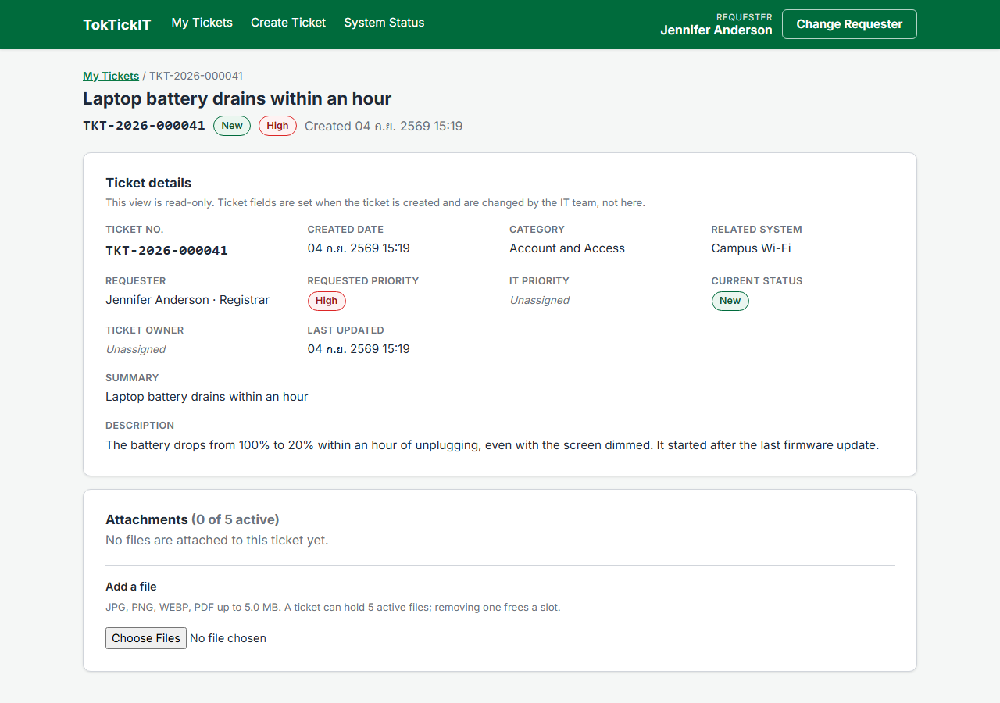
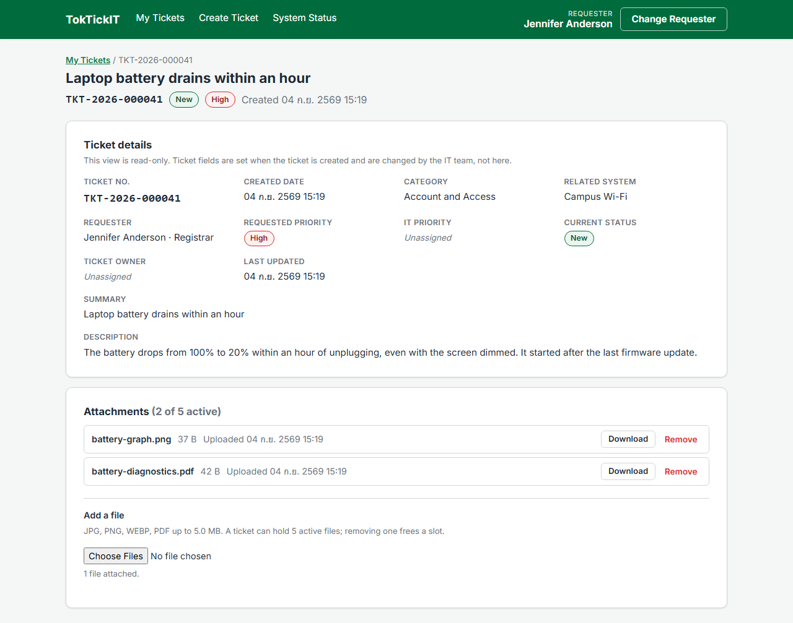
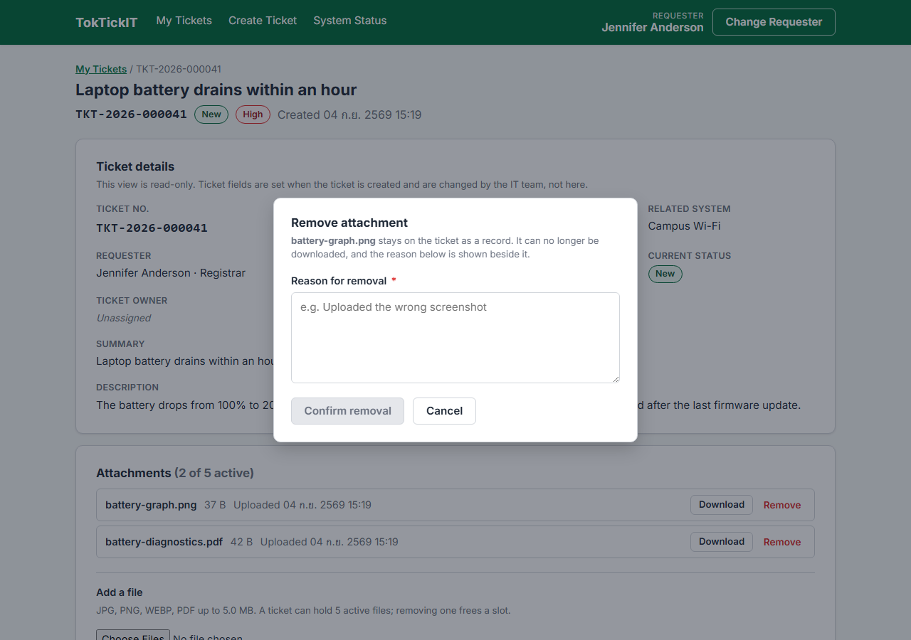
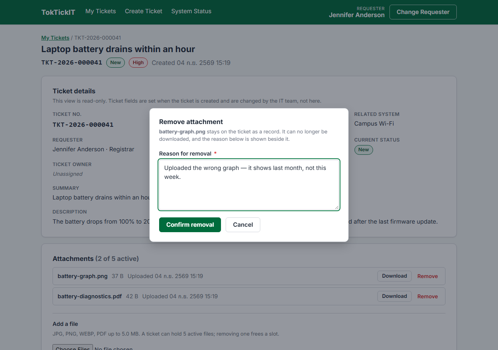
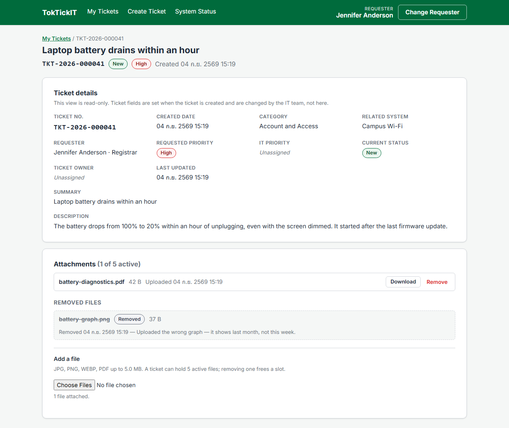
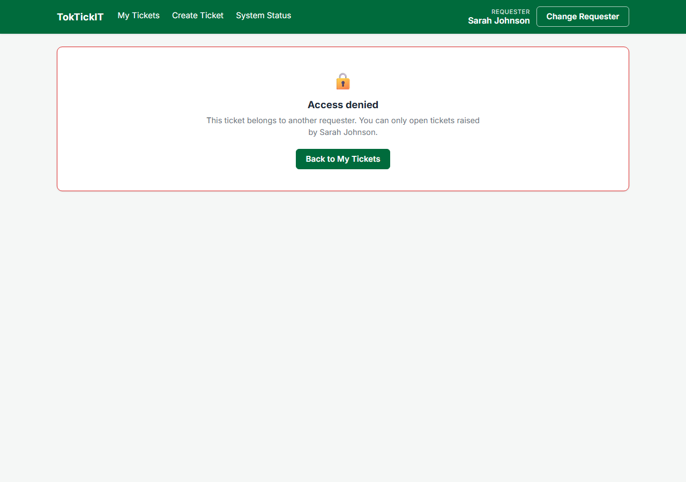

# Answer Part 8 — Ticket Detail and Attachment Lifecycle Evidence (Issue #6)

Six screenshots recording the Requester Ticket Detail screen and the soft attachment lifecycle (FR-04, FR-05, AC-03, AC-05, AC-06 … AC-09, BR-04 … BR-10).

Every image was captured against the **running stack with a real database** — Vite on :5173, the Express API on :5000, and PostgreSQL 16 on :5433. The ticket number, the stored files and the removal metadata are rows that genuinely exist in the `Ticket` and `Attachment` tables.

| Item | Value |
| --- | --- |
| Captured | 2026-09-04 |
| Ticket | `TKT-2026-000041` — *Laptop battery drains within an hour*, priority High, status New |
| Owner (Requester A) | Jennifer Anderson — Registrar |
| Intruder (Requester B) | Sarah Johnson — Finance |
| Files used | `battery-diagnostics.pdf` (42 B, `%PDF-1.7` header), `battery-graph.png` (37 B, real PNG signature) |
| Browser / viewport | Chromium, 1280 px wide (375 px for the mobile checks) |
| Capture script | [`screenshots/capture-issue6.mjs`](screenshots/capture-issue6.mjs) |

The ticket was created through the real `POST /api/tickets` and the files through the real `POST /api/tickets/:id/attachments`, so the ticket number and the `New` status are server-generated and the stored files are on disk under `server/uploads/`.

---

## 1. Ticket Detail of a ticket the requester owns — read-only



Every field the issue lists is on the page: Ticket No., Created Date, Category, Related System, Requester, Requested Priority, IT Priority, Current Status, Ticket Owner, Last Updated, Summary and Description.

They are rendered as a definition list, not as a disabled form. That distinction is the point of AC-05: a greyed-out input still reads as *editable, but not right now*, which is the wrong promise on a screen where nothing is ever editable. There is no Edit button, no Save button and no status control anywhere — not disabled, absent. IT Priority and Ticket Owner carry the same italic *Unassigned* placeholder as the list, because both are IT-triage fields with no column in the Lab 2 schema.

Covered by **UI-05** in `client/src/components/TicketDetail.test.tsx`, which asserts that the ticket-fields region contains no `input`, `textarea`, `select` or button at all.

---

## 2. Adding a new attachment to an existing ticket



`battery-diagnostics.pdf` and `battery-graph.png` picked through the Add a file control and uploaded one request each to `POST /api/tickets/:id/attachments`. The counter reads *(2 of 5 active)* and each row shows the file name, its size and its upload time beside Download and Remove.

Uploads happen after the ticket exists rather than as part of creating it (api-spec.md §3.7), so a rejected file can never cost the requester the ticket. The helper text states the rules the server enforces: JPG, PNG, WEBP, PDF up to 5.0 MB, five active files per ticket.

The server decides the type from the file's leading bytes, not from its name or its `Content-Type`, so renaming an executable to `.pdf` does not get past BR-05. Covered by **API-08** (415 for a disallowed type, including the renamed-executable case), **API-07** (413 over 5 MB) and **API-09** (the sixth active file).

---

## 3. Downloading an active attachment


`battery-diagnostics.pdf` being downloaded. The button shows its busy state — the accessible name changes to *Downloading battery-diagnostics.pdf* as well as the label, so a screen-reader user is not told *Download* while the request is in flight. The response was deliberately delayed by 1.5 s for this capture so the in-flight state is visible; the download itself is a real one.

The download goes through `fetch` rather than a plain link, because the requester context travels in the `X-Requester-Id` header and an `<a href>` cannot carry it. The bytes that came back are saved beside the screenshots as [`detail-03-downloaded-file.pdf`](screenshots/detail-03-downloaded-file.pdf) — 42 bytes, byte-identical to what was uploaded.

---

## 4. The removal modal insists on a reason



Pressing Remove opens the modal with an empty reason box and **Confirm removal disabled**. A removal without a stated reason is not offered rather than merely rejected, which is BR-09 expressed in the interface.



With a reason typed, Confirm enables. Whitespace alone does not count: the button re-disables if the box holds only spaces, and the server repeats the check — `PATCH /api/attachments/:id/remove` answers `400 VALIDATION_FAILED` for a missing, blank or too-short reason.

Covered by **UI-06** (Confirm disabled until a reason is entered, and re-disabled when it is cleared) and **API-14** (`400` with the attachment unchanged).

---

## 5. The attachment after a soft removal



`battery-graph.png` under a *Removed files* heading: muted, struck through, carrying a `Removed` badge, the removal timestamp and the reason *"Uploaded the wrong graph — it shows last month, not this week."* There is **no Download button** on the row.

Nothing was deleted. The row is still in the `Attachment` table with `isRemoved = true`, `removedReason` and `removedAt` populated, and the file is still on disk — the record of what was attached survives the file becoming unreachable (BR-08, BR-10). The active counter drops back to *(1 of 5 active)*: removed files do not consume one of the five slots (BR-07).

The Download button is driven by the response's `downloadUrl` being `null` rather than by a rule restated on the client, so the screen and the server cannot disagree about what is downloadable.

Covered by **API-10** (`200`, `isRemoved` true, reason and timestamp stored, no delete issued) and **API-11** (the removed file is refused).

---

## 6. Unauthorized access — another requester's ticket and file



The same ticket URL opened after switching to Sarah Johnson. The screen is an access-denied panel; none of the ticket's data is on the page, because none of it was returned.

The refusal is the server's, not the screen's. The same request made directly during the capture run:

```
GET /api/tickets/<id>   X-Requester-Id: <Sarah>
403 {"error":{"code":"FORBIDDEN","message":"This ticket belongs to another requester."}}
```

`GET /api/attachments/:id/download` answers `403` the same way for a file on someone else's ticket, and sends no `Content-Disposition` and no bytes. A removed attachment also answers `403` rather than `404`, because the resource genuinely exists and its owner can still see the metadata — what is refused is the state, not the existence.

Covered by **API-05** (Requester B reading Requester A's ticket), **E2E-03** in `e2e/ownership.spec.ts` (both the screen and the two endpoints) and **UI-05**'s access-denied assertions.

---

## Responsive evidence

| Screenshot | Viewport | Note |
| --- | --- | --- |
| [`detail-desktop.png`](screenshots/detail-desktop.png) | 1280 px | R-08 — four-column field grid, attachment rows on one line |
| [`detail-mobile.png`](screenshots/detail-mobile.png) | 375 px | R-09 — single-column fields, stacked attachment actions |
| [`remove-modal-mobile.png`](screenshots/remove-modal-mobile.png) | 375 px | R-10 — full-width modal buttons |

Measured rather than eyeballed on the mobile capture: `document.body.scrollWidth` is 375 px against a 375 px viewport, so there is no horizontal overflow (V-03).
