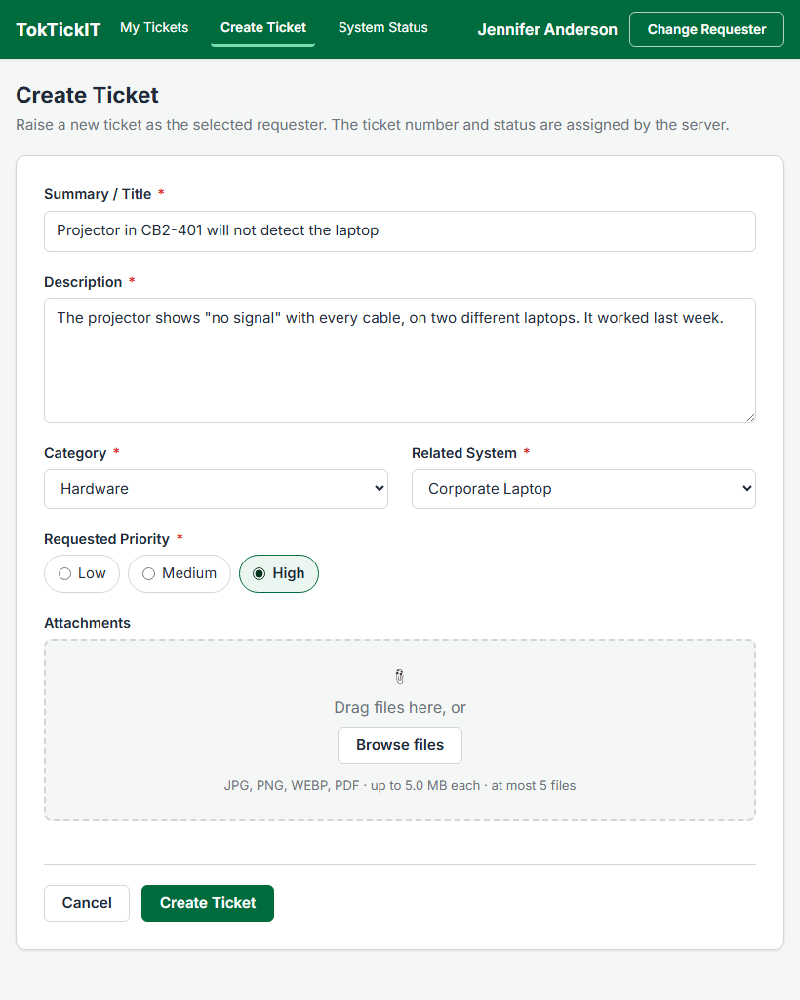
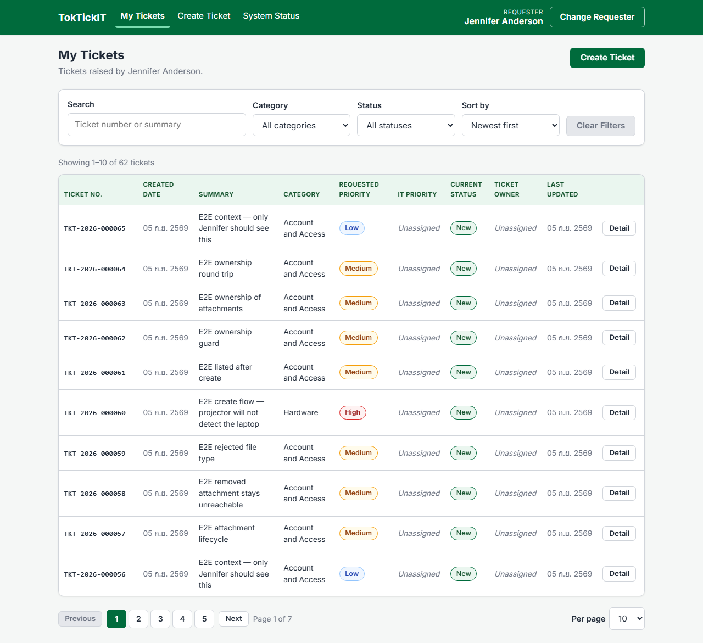
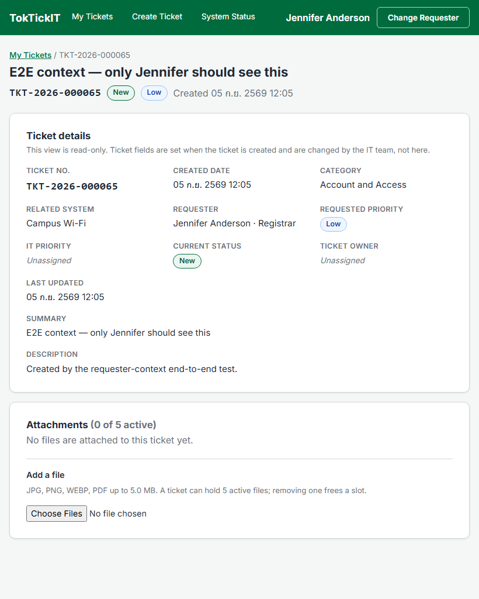
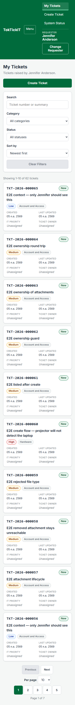

# Answer Part 9 — Responsive Layout Evidence (Issue #7)

The three main screens at all three breakpoints, plus the selector and the mobile header. Every image was captured against the **running stack with a real database** — Vite on :5173, the Express API on :5000, PostgreSQL 16 on :5433 — by [`screenshots/capture-issue7.mjs`](screenshots/capture-issue7.mjs), which prints the measured body width beside each capture.

| Item | Value |
| --- | --- |
| Captured | 2026-09-05 |
| Requester | Jennifer Anderson — Registrar (53 tickets) |
| Breakpoints | Desktop 1280 px, Tablet 820 px, Mobile 375 px |
| Browser | Chromium, full-page capture |
| Overflow measurement | `document.body.scrollWidth` against `window.innerWidth` at every stop |

The ticket summaries beginning `E2E` are rows the end-to-end suite created through the real API. They are genuine tickets, not fixtures: the suite runs against the same database the screenshots were taken from.

---

## 1. Create Ticket

| Breakpoint | Screenshot | Body width |
| --- | --- | --- |
| Desktop 1280 px | [`create-desktop.png`](screenshots/create-desktop.png) | 1280 px, no overflow |
| Tablet 820 px | [`create-tablet.png`](screenshots/create-tablet.png) | 820 px, no overflow |
| Mobile 375 px | [`create-mobile.png`](screenshots/create-mobile.png) | 375 px, no overflow |

The tablet capture is the one worth looking at closely. From 768 px the form lays its short fields out two to a row — Category beside Related System, Priority beside the space it needs — while Summary, Description and the upload area keep the full width. Those three are the fields whose content benefits from the extra room; a half-width Description would fight the reader for no gain.

Field order follows ui-spec §3.2, every required field carries its red asterisk, and the dropzone states the rules it enforces (JPG, PNG, WEBP, PDF · up to 5.0 MB each · at most 5 files).

At mobile the form returns to a single column and the actions become full-width buttons, with Create Ticket above Cancel so the primary action sits under the thumb.

---

## 2. My Tickets

| Breakpoint | Screenshot | Body width |
| --- | --- | --- |
| Desktop 1280 px | [`list-desktop.png`](screenshots/list-desktop.png) | 1280 px, no overflow |
| Tablet 820 px | [`list-tablet.png`](screenshots/list-tablet.png) | 820 px, no overflow |
| Mobile 375 px | [`list-mobile.png`](screenshots/list-mobile.png) | 375 px, no overflow |

All ten columns fit the desktop container with the Detail action still on screen. That is what the table's 66 rem minimum width buys: it matches the page container exactly, so the desktop table never scrolls, and at tablet width the same table scrolls inside its own wrapper rather than squeezing its columns until a ticket number runs under the date beside it.

Below 768 px the table becomes a card list. Each card carries the ticket number, the status badge, the summary, the priority and category chips, and the four date and owner fields as a two-column definition list; the whole card is the tap target. Filters stack full width, and Previous and Next share a row with the numbered pages below them.

---

## 3. Ticket Detail

| Breakpoint | Screenshot | Body width |
| --- | --- | --- |
| Desktop 1280 px | [`detail-desktop.png`](screenshots/detail-desktop.png) | 1280 px, no overflow |
| Tablet 820 px | [`detail-tablet.png`](screenshots/detail-tablet.png) | 820 px, no overflow |
| Mobile 375 px | [`detail-mobile.png`](screenshots/detail-mobile.png) | 375 px, no overflow |

The field grid is `auto-fit` with a 210 px minimum, so it finds four columns at desktop, three at tablet and one at mobile without a breakpoint of its own. Summary and Description always span the full row.

Every value is plain text on the card surface with a muted uppercase label above it — no input chrome anywhere, because there is no input anywhere. That is AC-05, and it is asserted rather than assumed: UI-05 fails if the ticket-fields region contains a single `input`, `textarea`, `select` or button.

---

## 4. Selector and mobile header

| Item | Screenshot |
| --- | --- |
| Requester Selection, desktop (R-01) | [`selector-desktop.png`](screenshots/selector-desktop.png) |
| Requester Selection, mobile (R-02) | [`selector-mobile.png`](screenshots/selector-mobile.png) |
| Header with the compact menu open, mobile (R-11) | [`header-mobile.png`](screenshots/header-mobile.png) |

Below 768 px the navigation, the requester name and Change Requester collapse behind a Menu toggle, so the header stays one line high and nothing overflows. Change Requester is reachable from every screen, which is what FR-06 requires.

---

## 5. What the responsive pass measured

Nine screen-and-width combinations, checked by reading the page rather than looking at it:

| Check | Result |
| --- | --- |
| Horizontal overflow (V-03) | `body.scrollWidth` equals the viewport width in all nine captures |
| Clipped text (V-04) | Every leaf element's `scrollWidth` compared against its `clientWidth`; the only hit is the deliberately `visually-hidden` file input |
| Labelling (V-06) | No `input`, `select` or `textarea` without a label, wrapping label or `aria-label` |
| Touch targets | Every control at 375 px is at least 44 px tall, up from 28–38 px before this pass |
| Contrast (V-07) | Lowest ratio 4.83:1 on muted dates, above the 4.5:1 AA floor; badges 6.84:1 to 8.21:1 |
| Focus ring (V-05) | `2px solid rgb(11, 122, 70)`, which is `--zg-secondary` |

The full checklist, including what this pass changed rather than confirmed, is in [ui-spec.md](ui-spec.md) §5.
