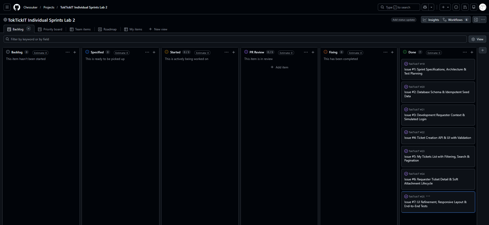
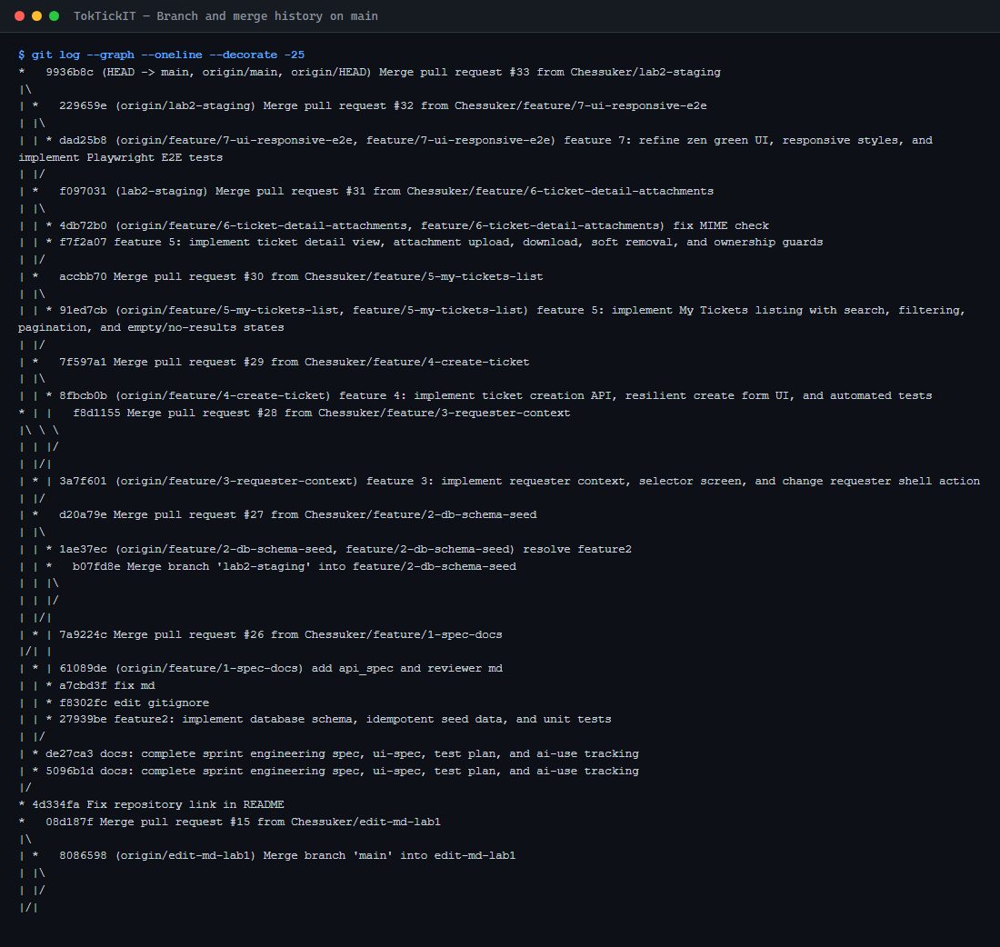

# Lab 2 — Peer Review Documentation

Record of the peer review performed on this sprint: who reviewed, which pull requests, what was raised, and how it was resolved.

---

## 1. Peer Reviewer Information

| Field | Detail |
| --- | --- |
| Name |  Theehathat |
| Student ID | 67070501019 |
| GitHub Username | [TeekhathatTT](https://github.com/TeekhathatTT) |
| Their repository, which I reviewed | https://github.com/TeekhathatTT/CPE334-TokTickIT |
| My repository, which they reviewed | https://github.com/Chessuker/TokTickIT |

### My Information

| Field | Detail |
| --- | --- |
| Name | Thawat Boonsuk |
| Student ID | 67070501024 |
| GitHub Username | Chessuker |

---

## 2. Reviewed PR Links

Pull requests submitted by me and reviewed by my partner, and vice versa. One row per PR.

Every PR below was opened by **Chessuker** and reviewed by **TeekhathatTT**. Issue branches went to `lab2-staging` first and reached `main` only through the release PR at the bottom of the table; #28 is the exception, merged to `main` directly before the staging workflow settled.

Two of the seven were sent back before they were approved. That is the part of this table worth reading: #27 and #31 both changed the code.

| # | Issue | PR Link | Branch | Base | Reviewed By | Merged | Review Outcome |
| --- | --- | --- | --- | --- | --- | --- | --- |
| 1 | #1 Spec & test planning | [#26](https://github.com/Chessuker/TokTickIT/pull/26) | `feature/1-spec-docs` | `lab2-staging` | TeekhathatTT | 2026-08-23 | Changes requested → **Approved** |
| 2 | #2 Database schema & seed | [#27](https://github.com/Chessuker/TokTickIT/pull/27) | `feature/2-db-schema-seed` | `lab2-staging` | TeekhathatTT | 2026-08-27 | Changes requested → fixed |
| 3 | #3 Requester context | [#28](https://github.com/Chessuker/TokTickIT/pull/28) | `feature/3-requester-context` | `main` | TeekhathatTT | 2026-08-28 | **Approved** |
| 4 | #4 Ticket creation | [#29](https://github.com/Chessuker/TokTickIT/pull/29) | `feature/4-create-ticket` | `lab2-staging` | TeekhathatTT | 2026-08-29 | **Approved** |
| 5 | #5 My Tickets list | [#30](https://github.com/Chessuker/TokTickIT/pull/30) | `feature/5-my-tickets-list` | `lab2-staging` | TeekhathatTT | 2026-08-30 | **Approved** |
| 6 | #6 Ticket detail & attachments | [#31](https://github.com/Chessuker/TokTickIT/pull/31) | `feature/6-ticket-detail-attachments` | `lab2-staging` | TeekhathatTT | 2026-09-04 | Changes requested → **Approved** |
| 7 | #7 UI refinement & E2E | [#32](https://github.com/Chessuker/TokTickIT/pull/32) | `feature/7-ui-responsive-e2e` | `lab2-staging` | TeekhathatTT | 2026-09-05 | **Approved** |
| 8 | Sprint release | [#33](https://github.com/Chessuker/TokTickIT/pull/33) | `lab2-staging` | `main` | — release merge of already-reviewed work | 2026-09-05 | Merged |

---

## 3. My PRs (submitted by me, reviewed by my partner)

| PR Link | Partner's Review Comments | My Response | Outcome |
| --- | --- | --- | --- |
| [#26](https://github.com/Chessuker/TokTickIT/pull/26) — Issue #1, spec & test plan | **Changes requested.** Two structural items: split the API contract out of `specification.md` into its own `docs/lab-02/api-spec.md`, and create `docs/lab-02/reviewer.md` to record the peer review | Both done in the same branch. Splitting the contract out turned out to matter more than it looked: `api-spec.md` became the document every later PR was argued against | **Approved** — "Everything in this feat is done. Good job!" Merged 2026-08-23 |
| [#27](https://github.com/Chessuker/TokTickIT/pull/27) — Issue #2, schema & seed | **Changes requested.** "1. ใน PR บอกว่าเพิ่ม AD-07/08/09/11 แต่ใน spec ยังมีแค่ AD-01 ถึง AD-06 เหมือนเดิม 2. typo `toktikit` (ขาด \"c\") ใน docker-compose และ .env.example" | Fixed both in commit `1ae37ec`. The first one was the PR description claiming decisions the specification did not actually contain — the description was ahead of the document | **Fixed and merged** 2026-08-27. The typo would have broken the database name in two config files at once |
| [#28](https://github.com/Chessuker/TokTickIT/pull/28) — Issue #3, requester context | **Approved.** "ตรงตามที่ระบุใน description ทุกอย่างแล้ว เก่งมาก bro" | — | **Approved**, merged 2026-08-28 |
| [#29](https://github.com/Chessuker/TokTickIT/pull/29) — Issue #4, ticket creation | **Approved.** "**T major เช็คแล้วตรงกับ PR ทุกจุด:**  - Commit history ตรง (`8fbcb0b` บน `3a7f601` บน `d20a79e`)  - Ticket number gen ในทรานแซคชันเดียวกับ insert, retry - `status` ไม่เขียนจาก request, `requesterId` มาจาก header - Validation ปฏิเสธ `status`/`ticketNumber` ที่ client ส่งมา - `/api/categories` → `{ data }`, เพิ่ม `/api/related-systems` - ไม่มี migration ใหม่, ไม่มี secret หลุด" | — | **Approved**, merged 2026-08-29 |
| [#30](https://github.com/Chessuker/TokTickIT/pull/30) — Issue #5, My Tickets list | **Approved.** "เช็คแล้วตรงกับ PR ทุกจุด เก่งมาก" — with the specifics named: file line counts matched the diff, `requesterId` read only from the header and never from the query string, duplicate query parameters rejected rather than last-one-wins, the `id:asc` tie-break that stops a row appearing on two pages, search covering ticketNumber/summary/description with the 300 ms debounce and the request-id guard, and no migration | "แน่นอนครับ เก่งอยู่แล้ว ขอบพระทัย" | **Approved** — "ขอบคุณแล้ว merge ได้". Merged 2026-08-30 |
| [#31](https://github.com/Chessuker/TokTickIT/pull/31) — Issue #6, detail & attachments | **Changes requested.** "แก้ที่: `server/src/app.ts` + `attachmentUpload.ts` / ปัญหา: ไฟล์ผิดชนิด+เกินขนาด ในโค้ดแจ้ง error 413 (`api-spec.md`) บอกว่าต้องเป็น 415 นะจ้ะ / แก้: ปรับให้ MIME check มาก่อน size check / ที่เหลือถูกต้องแล้ว เก่งมาก" | "จัดไปพี่ชาย รอสักครู่" → fixed → "Commit + Push ไปแล้วครับ". Confirmed and reproduced first: the check order in the route was already MIME-before-size; the real cause was `multer`'s `limits.fileSize`, which aborts the request before the route can read any of the content, so an oversized file could never reach the type check. Replaced it with a storage engine that retains the first 5 MB + 1 bytes and counts the rest | **Approved** — "เช็คแล้ว ถูกต้อง". Fixed in `4db72b0`: six regression tests added for requests that break two rules at once, re-verified over real HTTP (6 MB `.txt` → `415`, 6 MB PNG → `413`, 50 MB PNG → `413`, 6 MB PNG into another requester's ticket → `403`). `api-spec.md` §3.7 corrected, since its claim that the middleware enforced the size limit was no longer true. Merged 2026-09-04 |
| [#32](https://github.com/Chessuker/TokTickIT/pull/32) — Issue #7, UI & E2E | **Approved.** "GOOD JOB FROM SAMSUNG" | — | **Approved**, merged 2026-09-05 |

Quotes are the reviewer's own words as they appear on the pull request. The #29 row is the exception: it summarises a longer point-by-point review rather than quoting it. The full #31 exchange — request, fix, approval, merge — is visible in [`pr-approval-#31.png`](screenshots/pr-approval-%2331.png).

---

## 4. Partner's PRs (submitted by my partner, reviewed by me)

Partner repository: <https://github.com/TeekhathatTT/CPE334-TokTickIT>

| PR Link | My Review Comments | Partner's Response | Outcome |
| --- | --- | --- | --- |
| [#19](https://github.com/TeekhathatTT/CPE334-TokTickIT/pull/19) — `feature/spec-tests` → `lab2-staging`, Lab 2 documentation | **Approved.** "The Sprint Goal, FRs, BRs, AC, API contract, UI design, and test plan are well-integrated and will guide implementation cleanly. Looks ready to merge once you have the peer review feedback recorded." The one thing I asked for before merge was the peer-review record itself, which is the same gap my own #26 was sent back for | — | **Approved** 2026-08-22, merged 2026-08-23 |
| [#20](https://github.com/TeekhathatTT/CPE334-TokTickIT/pull/20) — `feature/lab2-requester` → `lab2-staging`, Development Requester | **Changes requested, twice.** First pass, 2026-08-24: the test imports and the module-mock path did not match, so `vi.mock` was pointing at a path the code never imported and **the Prisma mock was never applied** — the suite was green while talking to a real database. I gave the exact import and mock target: `import app from '../../src/app.js'`, `import { getPrisma } from '../../src/prisma.js'`, `vi.mock('../../src/prisma.js')`.  Second pass, 2026-08-26: asked to confirm the `vi.mock()` call ordering in `requesters.test.ts`, and — marked optional — whether the Prisma 5 → 6 upgrade was deliberate and whether migrations and seed still ran in CI | "แก้แล้ว แต่ตรง optional ไม่ทำ" — the required fix was made, the two optional checks were left | **Approved** 2026-08-27 — "Ok son, if you said so, Approve." Merged the same day |

The #20 finding is the one worth keeping. A mock aimed at the wrong path fails silently: nothing errors, the tests pass, and the only symptom is that a suite which claims to need no database quietly needs one. It is the mirror image of what my partner found on my [#31](https://github.com/Chessuker/TokTickIT/pull/31) — both defects were invisible to a green test run, and both were caught by a person reading what the code actually did against what the document said it should do.

---

## 5. Review Checklist

What each review was checked against. Referenced from the review comments above.

| # | Item | Source |
| --- | --- | --- |
| RC-01 | The PR description matches what the diff actually changes | — |
| RC-02 | Every acceptance criterion claimed as done has a test that proves it | [tests.md](tests.md) |
| RC-03 | Tests are not skipped, flaky, or unrelated to the acceptance criteria | Lab sheet §9 |
| RC-04 | The API matches the documented contract — paths, status codes, error shapes | [api-spec.md](api-spec.md) |
| RC-05 | Ownership is enforced server-side, not only hidden in the UI | BR-04, AC-03 |
| RC-06 | Database migrations are reviewed, reversible in intent, and re-runnable | AC-13 |
| RC-07 | UI matches the Zen Green tokens and component rules | [ui-spec.md](ui-spec.md) |
| RC-08 | Responsive at all three breakpoints, no clipping or horizontal overflow | AC-11 |
| RC-09 | No secrets, credentials, or `.env` files committed | Lab sheet §10 |
| RC-10 | No unrelated files, build output, or compiled artifacts in the diff | — |

---

## 6. Screenshot Evidence

### 6.1 PR Approval Evidence

_Screenshots of each approved PR. One per merged pull request._

| # | PR | Screenshot |
| --- | --- | --- |
| 1 | [#31](https://github.com/Chessuker/TokTickIT/pull/31) — Issue #6: changes requested for the 413/415 defect, fixed in `4db72b0`, then approved | [`pr-approval-#31.png`](screenshots/pr-approval-%2331.png) |
| 2 | [#32](https://github.com/Chessuker/TokTickIT/pull/32) — Issue #7: approved, "GOOD JOB FROM SAMSUNG" | [`pr-approval-#32.png`](screenshots/pr-approval-%2332.png) |
| 3 | [#26](https://github.com/Chessuker/TokTickIT/pull/26) — Issue #1: changes requested (split out `api-spec.md`, add `reviewer.md`), then approved | [`pr-approval-#26.png`](screenshots/pr-approval-%2326.png) |
| 4 | [#29](https://github.com/Chessuker/TokTickIT/pull/29) — Issue #4: approved after a point-by-point check | [`pr-approval-#29.png`](screenshots/pr-approval-%2329.png) |

### 6.2 Kanban Board Evidence

_Final GitHub Project board with every Issue in Done._

| Screenshot |
| --- |
| [`kanban-final.png`](screenshots/kanban-final.png) |

All seven sprint issues in **Done**, every other column empty.

### 6.3 Branch and Merge History

_Commit history on `main` showing feature branches merged through staging into main._

| Screenshot |
| --- |
| [`docs/lab-02/screenshots/git-history.png`](screenshots/git-history.png) |

Seven feature branches into `lab2-staging`, then `lab2-staging` into `main` in a
single merge ([#33](https://github.com/Chessuker/TokTickIT/pull/33)). Nothing was
pushed straight to `main`. The same evidence, with the full PR table, is in
[answer-part1-git-workflow.md](answer-part1-git-workflow.md).

---

## 7. Review Summary

_A short account of what the review process caught this sprint: the most useful comment received, the most useful comment given, and anything that would have shipped broken without it._

**Most useful comment I received:** The 413/415 comment from TeekhathatTT on PR
[#31](https://github.com/Chessuker/TokTickIT/pull/31). It named two files, the rule
and the line of the spec the code disagreed with, which is why it took minutes to
confirm rather than an afternoon to argue about.

Second place goes to the review on [#26](https://github.com/Chessuker/TokTickIT/pull/26),
which sent the very first PR back to split the API contract out of
`specification.md` into its own file. That looked like filing at the time. It was
not: `api-spec.md` became the document every later PR was argued against, and the
#31 defect was only reviewable *because* the status codes lived somewhere a
reviewer could point at.

**Most useful comment I gave:** On my partner's
[#20](https://github.com/TeekhathatTT/CPE334-TokTickIT/pull/20): their test file
mocked a module path the code never imported, so the Prisma mock silently did
nothing and a suite advertised as database-free was talking to a real database.
Everything was green, which is exactly why nobody had noticed. I gave the correct
import and mock target rather than only naming the problem, and it was fixed in
the next commit.

**What the review caught that tests did not:** A defect that lived in the
*interaction* between two validation rules. Every individual rule in the upload
path had a test — oversized file, disallowed type, sixth attachment, missing
reason — and all of them passed. Nothing tested a request that broke two rules at
once, so nobody noticed that an oversized file of a disallowed type answered
`413` when `api-spec.md` §3.7 says the more specific `415` wins. The route's
check order had been correct since the day it was written; the cause was upload
middleware aborting the request before the route could read the content at all.

The lesson generalises past this one bug: a test plan built one row per
acceptance criterion tests each rule in isolation, which is exactly the shape
that misses ordering defects. Any endpoint with more than one validation now
deserves at least one test that breaks two rules at once and asserts which error
wins — six of those were added in `4db72b0`.
