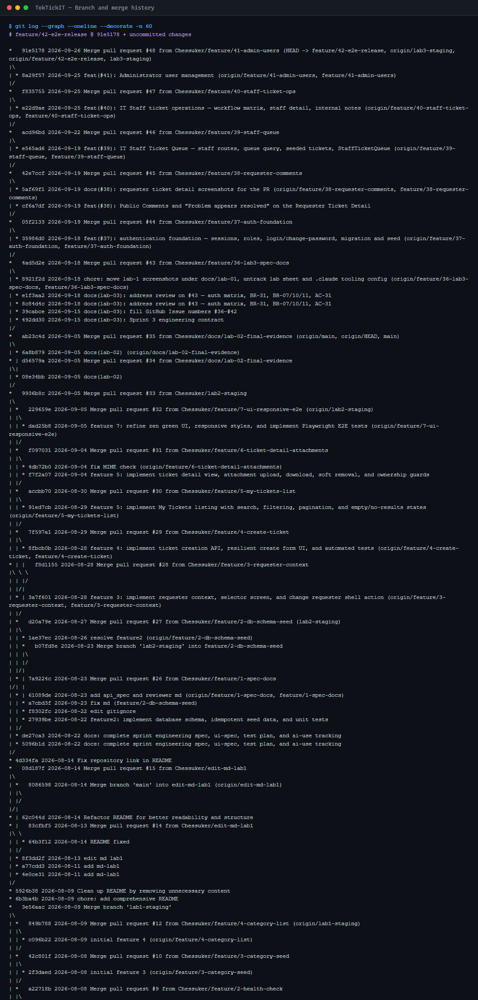

# Answer Part 1 — Git Use with Engineering Workflow

Repository: <https://github.com/Chessuker/TokTickIT> · Branch flow: `feature/<issue>-<slug>` → pull request → `lab3-staging` → release pull request → `main`.

---

## 1. Commit history: feature branches → `lab3-staging` → `main`

Every Lab 3 change reached `lab3-staging` through a pull request from its own feature branch; `git log --first-parent lab3-staging` contains nothing but those merges. The release pull request then merges `lab3-staging` into `main`.

| Issue | Pull request | Branch | Merged into `lab3-staging` |
| --- | --- | --- | --- |
| #36 Sprint 3 engineering contract | [#43](https://github.com/Chessuker/TokTickIT/pull/43) | `feature/36-lab3-spec-docs` | 2026-09-18 12:52 · `4ad5d2e` |
| #37 Authentication foundation | [#44](https://github.com/Chessuker/TokTickIT/pull/44) | `feature/37-auth-foundation` | 2026-09-19 12:32 · `05f2133` |
| #38 Requester regression, comments, resolution | [#45](https://github.com/Chessuker/TokTickIT/pull/45) | `feature/38-requester-comments` | 2026-09-19 18:31 · `42e7ccf` |
| #39 IT Staff Ticket Queue | [#46](https://github.com/Chessuker/TokTickIT/pull/46) | `feature/39-staff-queue` | 2026-09-22 22:44 · `acd96bd` |
| #40 IT Staff Ticket operations | [#47](https://github.com/Chessuker/TokTickIT/pull/47) | `feature/40-staff-ticket-ops` | 2026-09-25 13:44 · `f835755` |
| #41 Administrator user management | [#48](https://github.com/Chessuker/TokTickIT/pull/48) | `feature/41-admin-users` | 2026-09-26 · `91e5178` |
| #42 E2E, visual inspection, release | _PR link_ | `feature/42-e2e-release` | |
| Release Lab 3 | _PR link_ | `lab3-staging` → `main` | |



The image is the verbatim output of the command at its top, saved in [`test-runs/git-history.txt`](test-runs/git-history.txt).

---

## 2. GitHub Project / Kanban — all Issues in Done


---

## 3. Peer review

The rendered [`reviewer.md`](reviewer.md) follows this page: reviewer identity, the pull-request links above, comments given and received, responses, and approvals.

---

## 4. README and `.gitignore`

[`README.md`](../../README.md) documents the Lab 3 features, setup, migration (including upgrading a Lab 2 database), the seed and its local development accounts, and the test commands. It is rendered in full after `reviewer.md`.

`.gitignore` keeps secrets, dependencies, build output, uploaded files, test reports and the course lab sheets out of the repository — `.env` is ignored and no `.env` file is tracked; only `server/.env.example` is:

```gitignore
node_modules/
.env
.env.local
.env.*.local
dist/
build/
*.tsbuildinfo
logs/
*.log
.vscode/
.idea/
.claude/
Lab_3_sheet.pdf
*_labsheet.pdf
server/uploads/
e2e/report/
test-results/
playwright/.cache/
```

---

## 5. Repository structure (Lab 3 increment)

The layout the lab sheet (§12) requires, as it is on `main`, plus the extra suites this sprint added:

```text
docs/lab-03/
├── specification.md  api-spec.md  ui-spec.md  tests.md
├── reviewer.md  ai-use.md  issues.md  README.md
├── answer-part1 … answer-part9 *.md
├── build-submission-pdf.mjs
├── scripts/            capture-evidence.mjs · capture-api-authorization.mjs · capture-test-runs.mjs
└── test-runs/          server.txt · client.txt · e2e.txt · api-authorization.txt · git-history.txt

server/tests/lab-03/
├── auth.api.test.ts                authorization.api.test.ts
├── staff-queue.api.test.ts         staff-ticket-detail.api.test.ts
├── comments-notes.api.test.ts      users-admin.api.test.ts
└── passwordPolicy · loginThrottle · session · queueQuery · ticketWorkflow (.test.ts, unit)

client/src/components/lab-03/
├── Login · ChangePassword · StaffTicketQueue · StaffTicketDetail · UserManagement (.tsx + .test.tsx)
└── RequireAuth · Badges · CommentsPanel (tests), ThreadPanel · InternalNotesPanel · PasswordField

e2e/lab-03/
├── authentication.spec.ts  staff-ticket-flow.spec.ts  user-administration.spec.ts
└── requester-comments.spec.ts  staff-queue.spec.ts  visual.spec.ts

artifacts/lab-03/screenshots/
├── authentication/  staff-queue/  staff-ticket-detail/  user-management/
└── requester/  evidence/
```
