# Answer Part 5 — Working Login and Password Change UI

All screenshots are from the running stack on a freshly seeded database, captured by [`scripts/capture-evidence.mjs`](scripts/capture-evidence.mjs). Where the point is *where the browser ended up*, a dark bar at the bottom shows the URL — a screenshot has no address bar of its own. The same behaviours are asserted by `e2e/lab-03/authentication.spec.ts` (E2E-01 … E2E-03) and the Login / ChangePassword / RequireAuth component suites.

| Requirement | Screenshot | Rule |
| --- | --- | --- |
| Valid login | §6 below — user and role in the shell | FR-01, AC-01 |
| Invalid login | §1 | BR-06, AC-05 |
| Inactive account | §2 | BR-01, BR-06, AC-06 |
| Busy feedback | §3 | V-09 |
| Safe failure | §4 | AC-34 |
| Mandatory first-password change | §5 | BR-02, AC-02, AC-09 |
| Authenticated user / role display | §6 | FR-03 |
| Logout, and direct access blocked afterwards | §7 | FR-03, AC-08 |

---

## 1. Invalid login — one generic message

A wrong password and an unknown email get the same message, so the screen never reveals which accounts exist. The email is kept; the password is cleared.

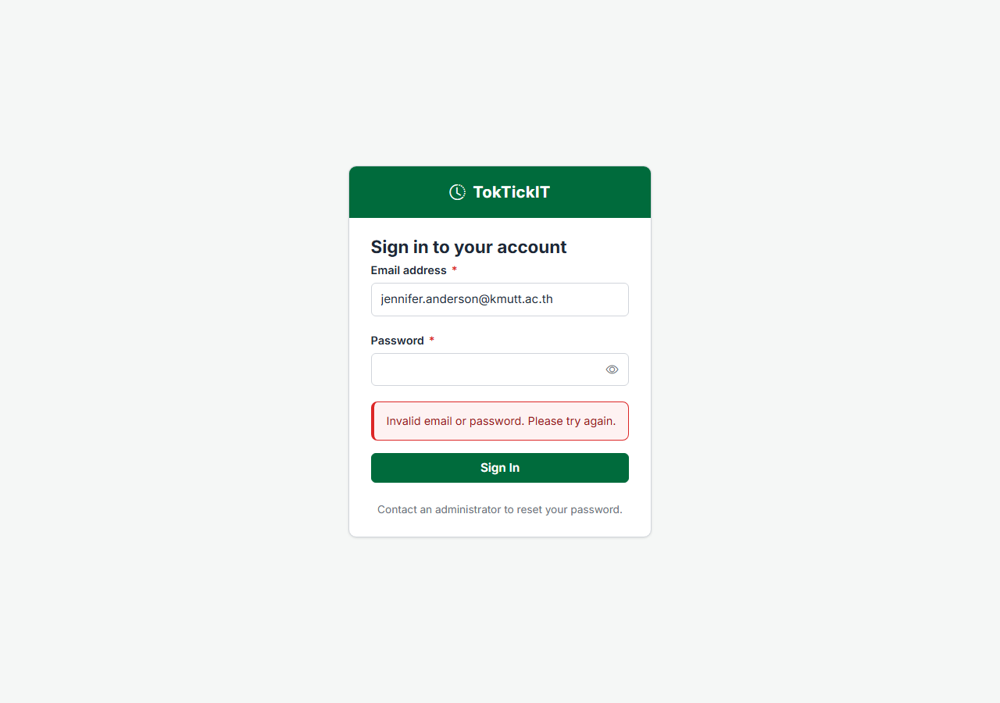

## 2. Inactive account

Only when the password is *correct* does an inactive account learn that it is inactive — an attacker without the password cannot tell.

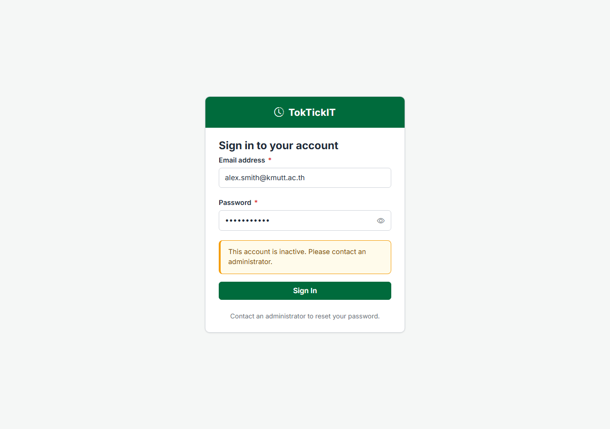

## 3. Busy state

While the request is in flight the button reads "Signing in…", shows a spinner and is disabled, and the fields are locked (the request was held for two seconds so it could be captured).

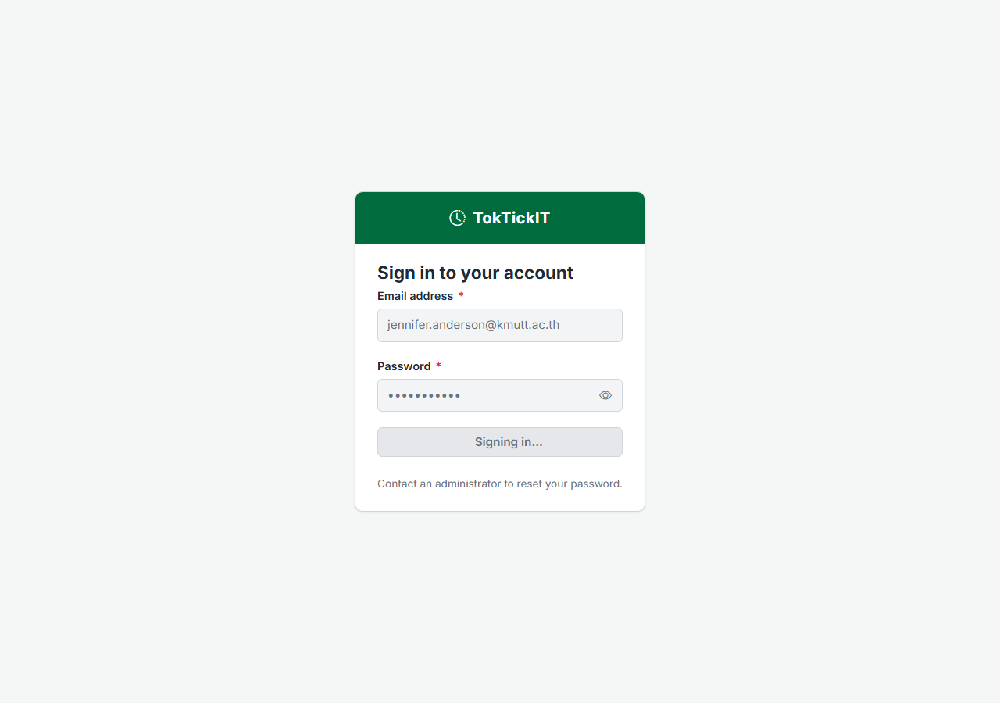

## 4. Safe failure — the backend is unreachable

The request never gets an answer. The screen says so in plain words, keeps the typed email, and shows nothing internal.

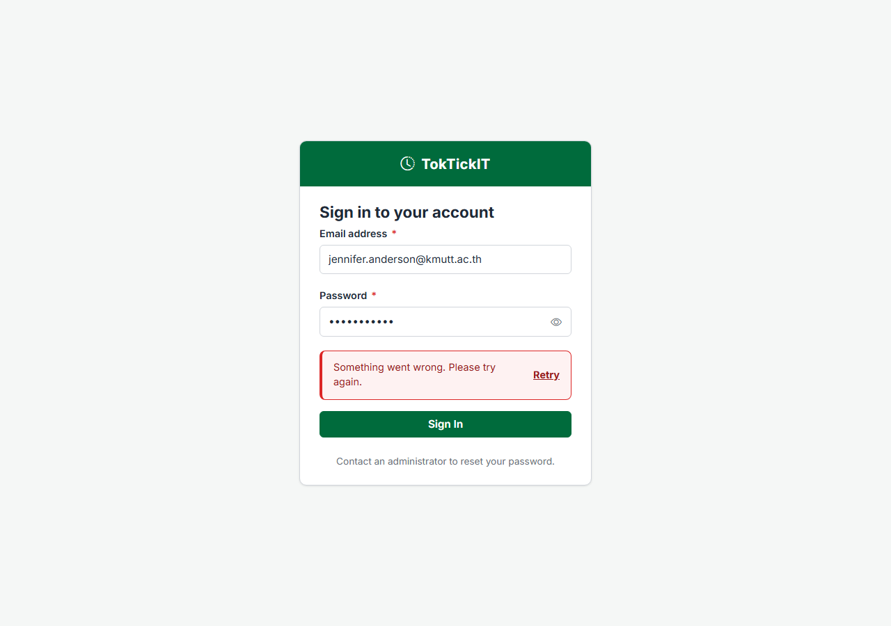

## 5. Mandatory password change at first login

Michael Brown is on his initial password. Signing in lands on Change Password — with no navigation, only Log out — and the BR-08 rules panel ticks each rule live. A new password that breaks the rules, and a confirmation that does not match, are refused under their own fields:

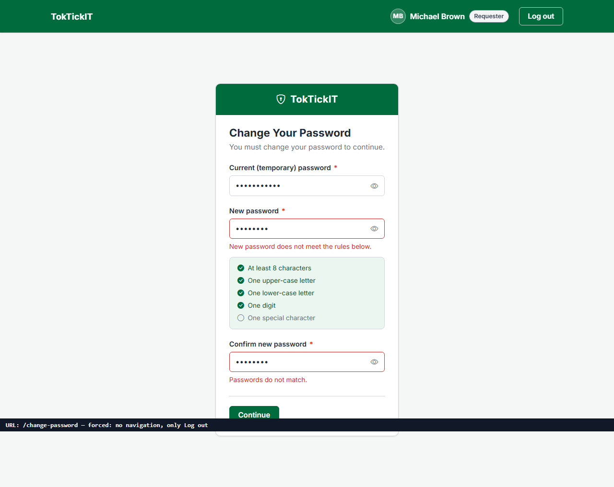

Trying to leave by typing another URL is sent straight back until the change is made — and the API answers `403 PASSWORD_CHANGE_REQUIRED` on every data route meanwhile:

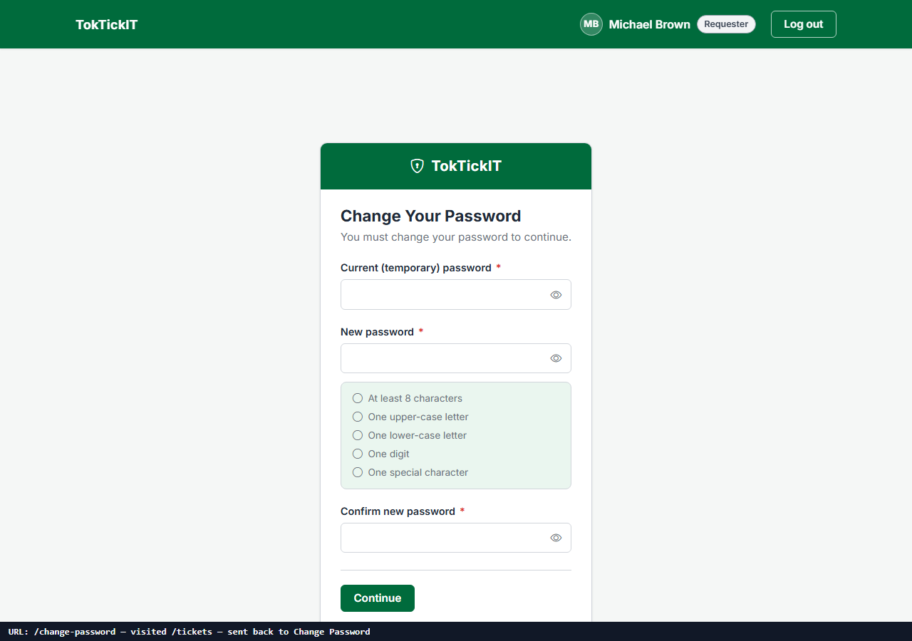

## 6. Authenticated user and role in the shell

After a valid login the header shows the user's name, initials and role badge; the profile menu offers Change password and Log out. Only the role's own links are rendered.

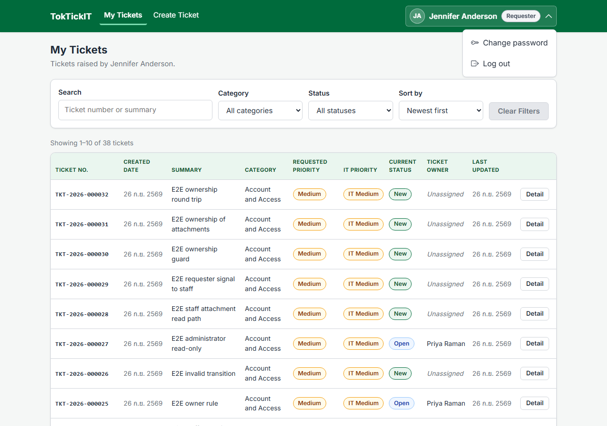

Each role's shell, profile menu open — Requester: My Tickets, Create Ticket; IT Staff: Queue; Administrator: Users, Queue:

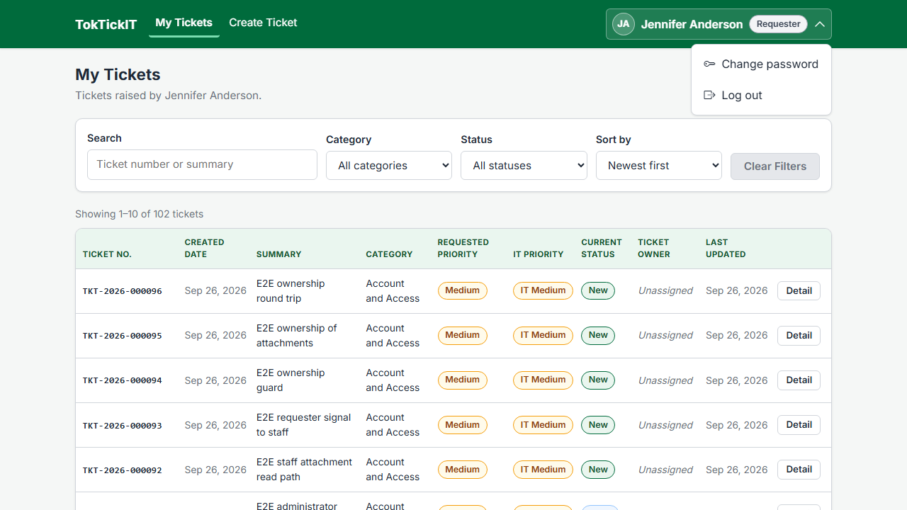

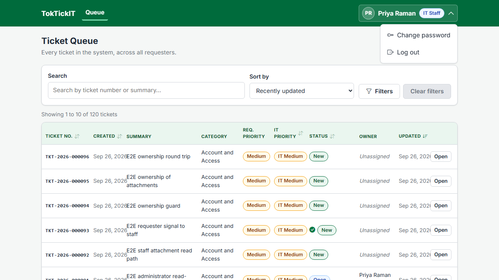

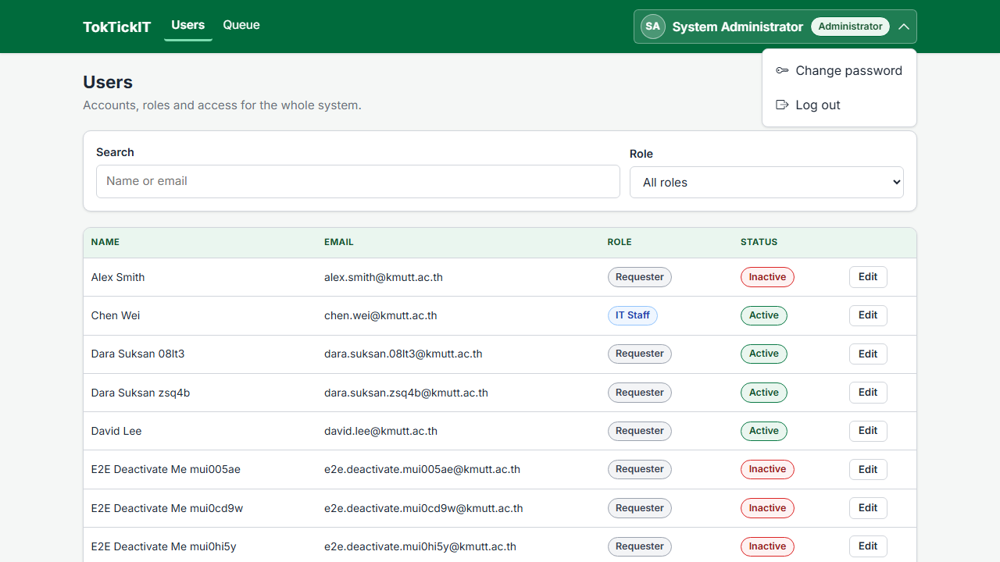

## 7. Logout, then direct access is blocked

Logout deletes the session row and clears the cookie. Afterwards a protected URL redirects to Login, and the API answers `401` to the same browser (recorded by the capture script: `GET /api/tickets after logout → 401`).

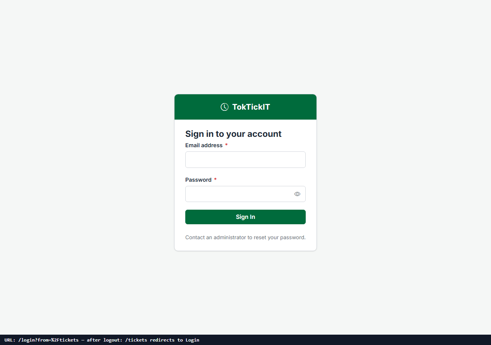
