# Answer Part 6 — Working IT Staff Ticket Queue UI

Signed in as Priya Raman (IT Staff) on the seeded database — 24 tickets across four requesters, every status at least twice, eight unassigned. Captured by [`scripts/capture-evidence.mjs`](scripts/capture-evidence.mjs); asserted by `e2e/lab-03/staff-queue.spec.ts` (E2E-05), `StaffTicketQueue.test.tsx` (UI-10 … UI-13) and `staff-queue.api.test.ts` (API-26 … API-30).

The queue keeps its state in the URL (`?status=Open&status=InProgress&owner=me&sort=…`), so a filtered view survives a reload, can be shared, and is where "Back to Queue" returns to. Every control re-queries the server; the list is never a client-side slice.

| Requirement | Section |
| --- | --- |
| Realistic data; assigned / unassigned ownership; status and priority badges | §1 |
| Search | §2 |
| Filters | §3 |
| Sorting | §4 |
| Pagination | §5 |
| Empty, no-results and failure feedback | §6 |
| Open-detail action | §7 |
| Responsive behaviour | §8 |

---

## 1. Realistic data, ownership and badges

Ten columns in the order the UI spec fixes. The owner is a name, or _Unassigned_ in muted italics; the signed-in user's own tickets carry a **You** tag. Requested and IT Priority are separate badges ("High" vs "IT High") so they are never confused when they differ. A check icon before the status marks a ticket the requester has reported as resolved.

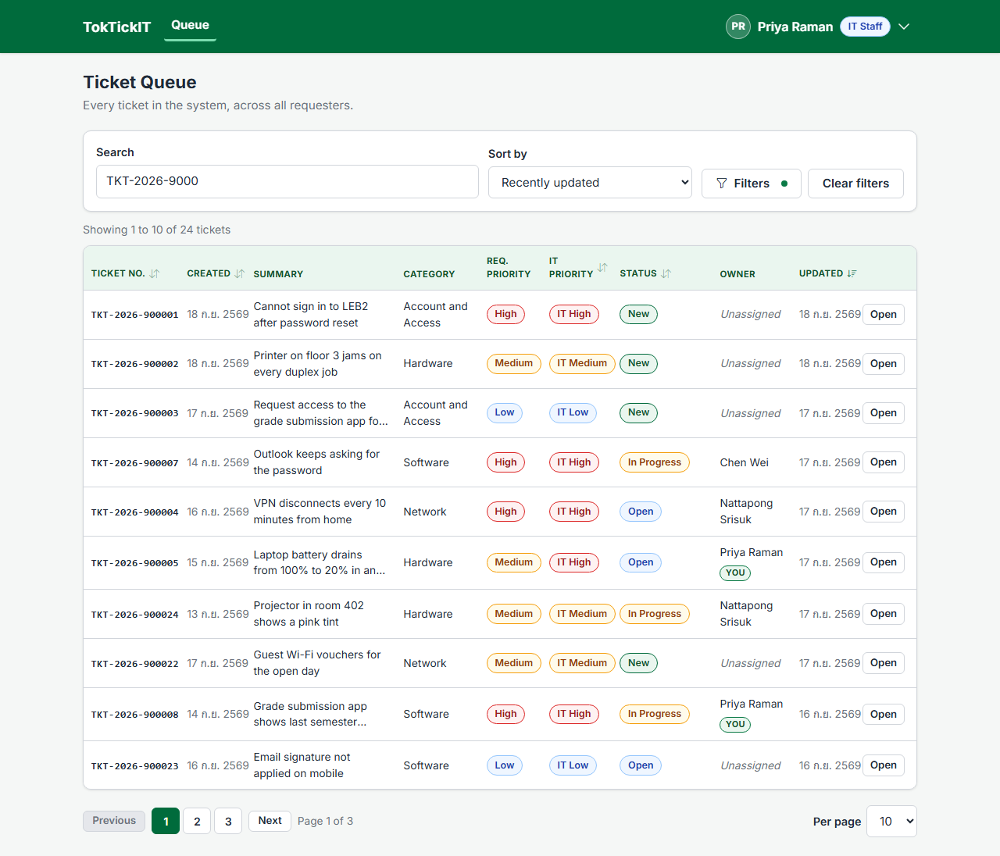

## 2. Search — ticket number or summary

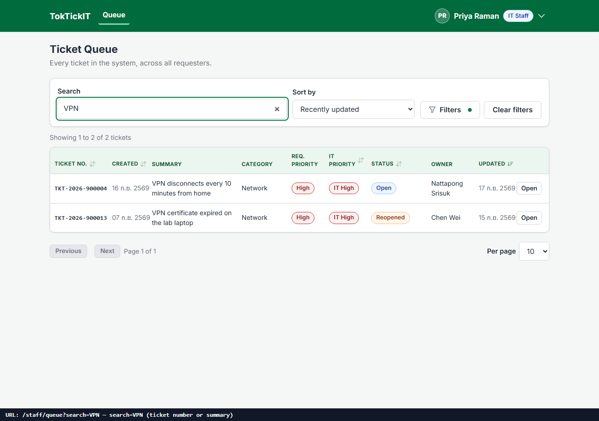

## 3. Filters — status chips, IT priority, owner, category

Two status chips combine as OR; the owner filter offers Anyone, Me, Unassigned and each active IT Staff member. A dot on "Filters" shows that filters are active.

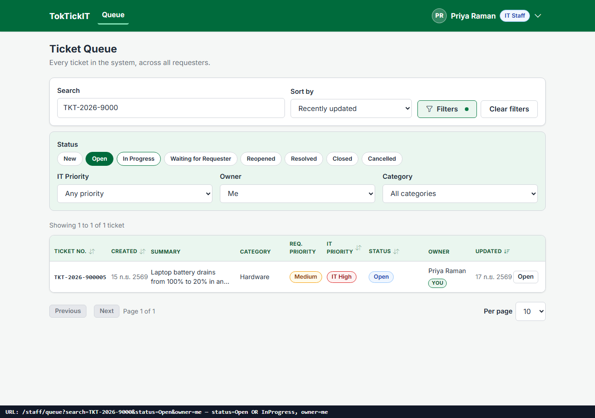

## 4. Sorting

Five columns sort from their header (with `aria-sort`), and the same ten options are in the Sort select. IT Priority sorts High → Medium → Low; Status sorts in workflow order, not alphabetically.

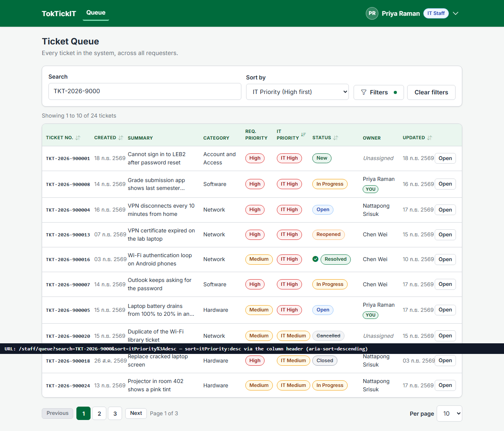

## 5. Pagination

5 / 10 / 25 / 50 per page (default 10), at most five page buttons, and a result line that describes the whole filtered set. Any filter change returns to page 1.

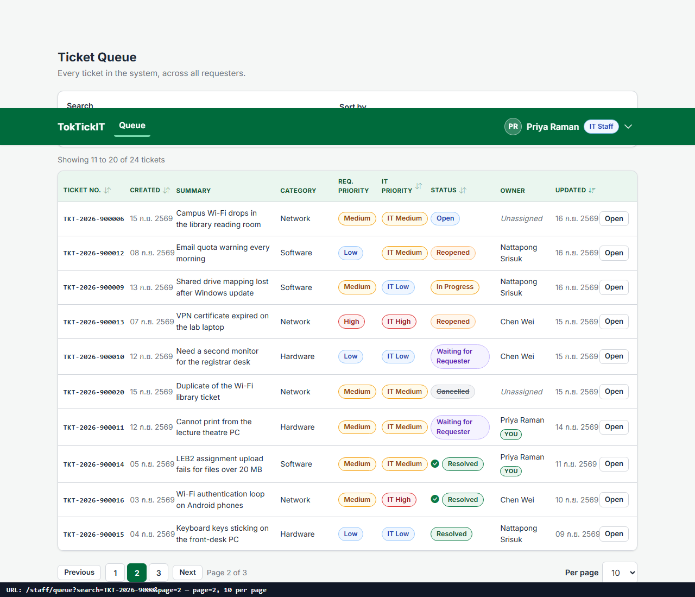

## 6. Empty, no-results and failure feedback

Three different situations, three different panels. "No tickets in the system yet" (a seeded system always has tickets, so this one request was answered with an empty list — the bar says so):

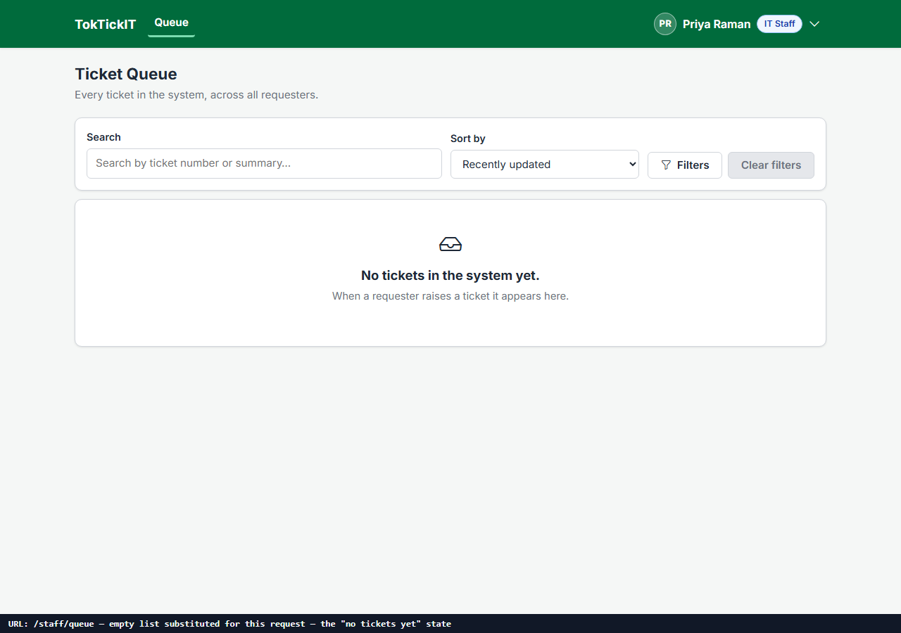

A search that matches nothing, with its own Clear filters action:

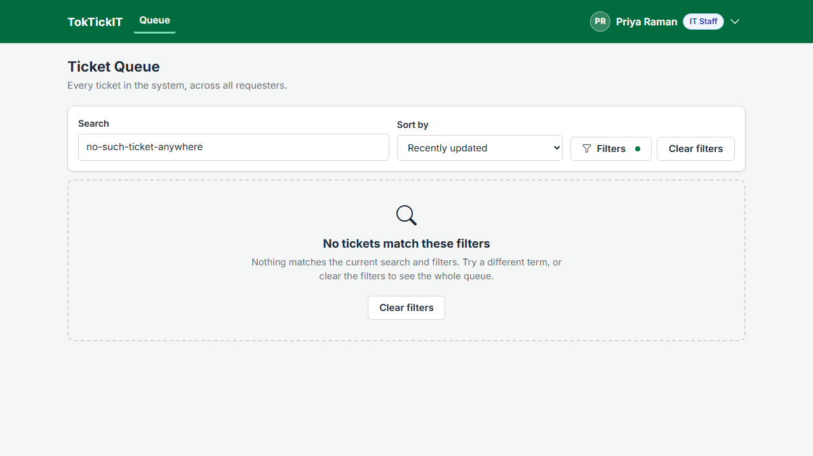

The API unreachable — a plain message and Retry, no internal detail; Retry recovers without a reload (asserted in `visual.spec.ts`):

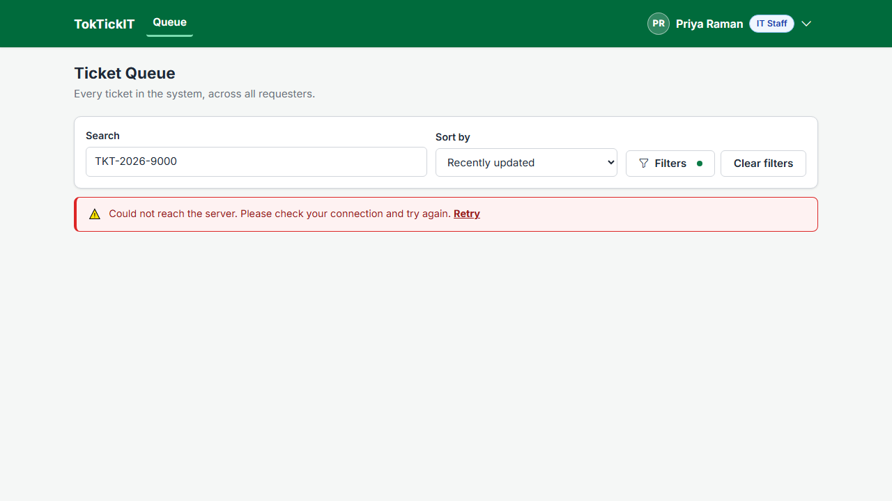

## 7. Open detail

"Open" on a row (or the whole card on mobile) goes to the staff Ticket Detail.

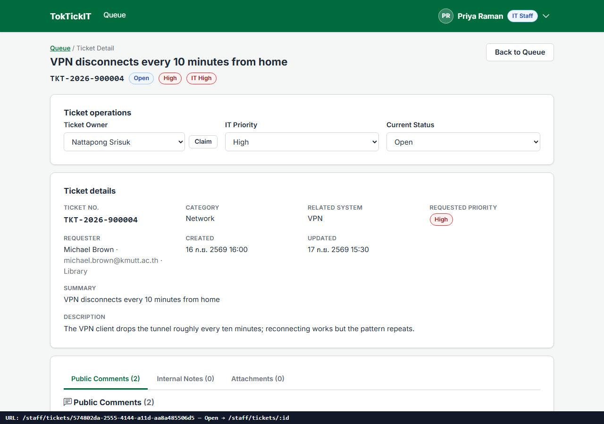

## 8. Responsive

Desktop shows the table; tablet keeps every column and scrolls inside the table's own wrapper — never the page; mobile turns each ticket into a card with Ticket No., status, summary, IT priority and owner.

| Tablet 820 px | Mobile 375 px |
| --- | --- |
| 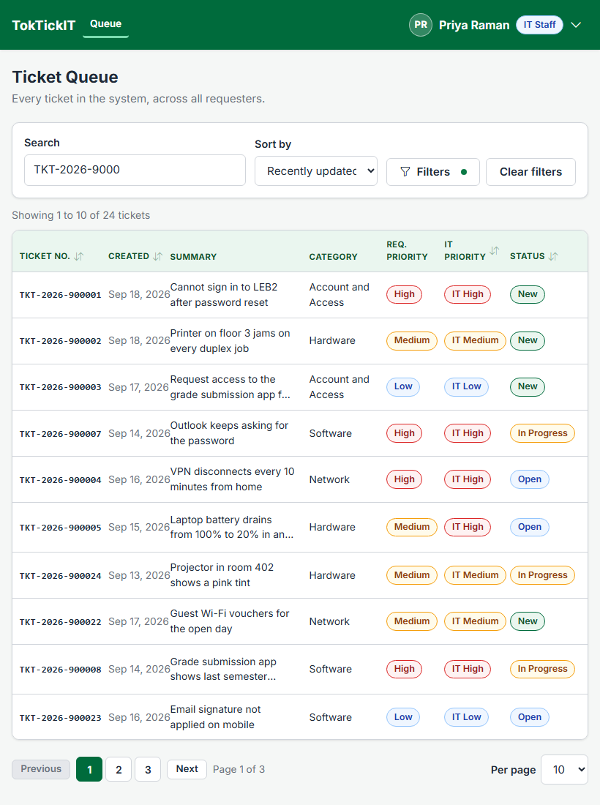 | 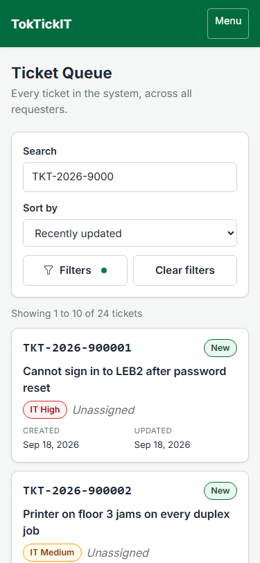 |
